# 官方数据校准与策略迁移实验

本报告记录第一版 B 题求解器之后的数据驱动实验。第一版数学证明、192次本地对照及四次官方演练仍保存在原论文和结果目录，不与本轮合并计数。本轮正式测试没有执行。

## 研究目标与当前证据

实验依次回答：相同采集协议下，本地环境能否解释官方关键反馈；在经过数据筛选的环境中选出的策略，能否降低新官方案例的整局完成时间。完整清除优先，总虚拟耗时其次。移动、测量、频道切换与失败清除是解释变量，不是可以替代全清目标的独立成绩。

从第一性原理看，官方轨迹同时由隐藏环境、固定误差场与决策规则产生。改变决策规则会改变访问位置，也就改变所见的无信号比例。故第一步必须冻结采集协议，才能把反馈差异解释为环境模型问题；调查固定全部站点与频道，补充自适应基线很少访问的条件。隐藏位置、半径与发射方向通常不能唯一恢复，校准的目标是保留相容模型，而不是为每个源猜出一个精确真值。

第二步将几何保证与经验效率分开：原始位置外包、覆盖及20米清除认证约束哪些动作和退出结论可信；有限假设网格与经验分布只影响动作排序。实际总虚拟时间始终按下式复核：

$$T=L_{walk}/5+N_{switch}+5N_{measure}+3N_{clear\_attempt}+2N_{clear\_success}.$$

因此少做一次测量不必然更快：它可能增加后续光学覆盖的移动与失败尝试。实验需要同一隐藏场景、同一固定误差场的本地配对对照，最后再以新官方独立案例检验迁移，不能把本地配对收益直接当作官方成绩。

已完成首轮160局官方演练、960次本地同协议检查及三阶段5800次策略运行，主要本地实验合计6760次。另按冻结计划完成120局新官方演练验证，四个题号/策略组各30局，全部确认清除。两题候选平均总虚拟耗时分别比新基线少12.74%和6.23%；下面同时给出不确定性、成本及适用边界。下文仅把实际落盘的运行计为完成，不用计划局数代替成绩。

## 冻结、分配与审计

原 `joint_triangular` 基线的10个核心文件合并SHA256为 `1b673484453104a5d87d4605d30b20826a3b7ec64769fd6ce8d3c8f7a1ad24f6`。原策略采用主动测点、三角覆盖、顺路处理、局部追加测量上限5。基线采集期间不调参。

每题60局基线、20局标准调查，共160个任务槽在机器人动作之前分配。每个题号与协议内按整局哈希排名划分75% fit、25% development，总计120局拟合、40局开发检查。最先四个先导案例覆盖两题与两种协议，完整执行后扩大采集。界面异步等待修复及零距离名义角字段修复有记录，没有改变基线或调查坐标。

调查固定扫描全部20频道：问题3为7个站点、140次测量，问题4为31个站点、620次测量。完整扫描结束前不清除、不按发现情况跳站或跳频道。随后按预注册种子随机选两个已发现频道，问题3每个增加16次调查、问题4每个19次，全部追加位置在追加阶段开始前固定，最后统一清除。

独立审计核对160局、53,959条请求：状态、动作去重、计时、覆盖、停止证据及原始日志散列均无问题。40局调查的全站全频道扫描证书全部通过。微秒级接口舍入下，逐响应累计计时最大差约0.00001253秒。

程序只通过公开四接口执行动作；原生Windows界面自动化读取可见案例信息与结束统计。N、Ndir进入事后审计，未返回当局策略。官方原始加密日志保留原文件名和字节，不解密或改写。正式测试控件不在采集器的允许操作中。

## 首轮官方实际结果

|题目与协议|实际局数|全清|失败|平均整局虚拟秒|平均移动米|平均测量数|平均失败清除数|
|---|---:|---:|---:|---:|---:|---:|---:|
|问题3基线|60|60|0|5047.85|21248.93|121.22|11.53|
|问题3调查|20|20|0|13248.95|60302.26|193.25|2.35|
|问题4基线|60|60|0|11172.30|43743.94|366.17|73.68|
|问题4调查|20|20|0|17613.19|68014.20|662.95|1.75|

调查的额外路程是采集成本，不能与正常求解时间混成策略平均值。问题3、4基线的移动成本分别约占总虚拟时间84.2%与78.3%。完整原始计数与高分位在 `results/pipeline_summary/official_collection.csv`，逐局结果在 `official_cases.csv`。

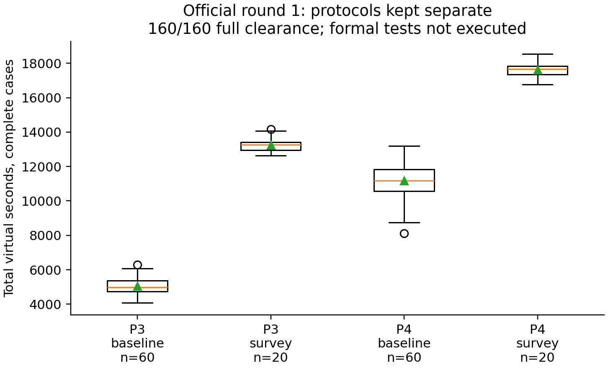

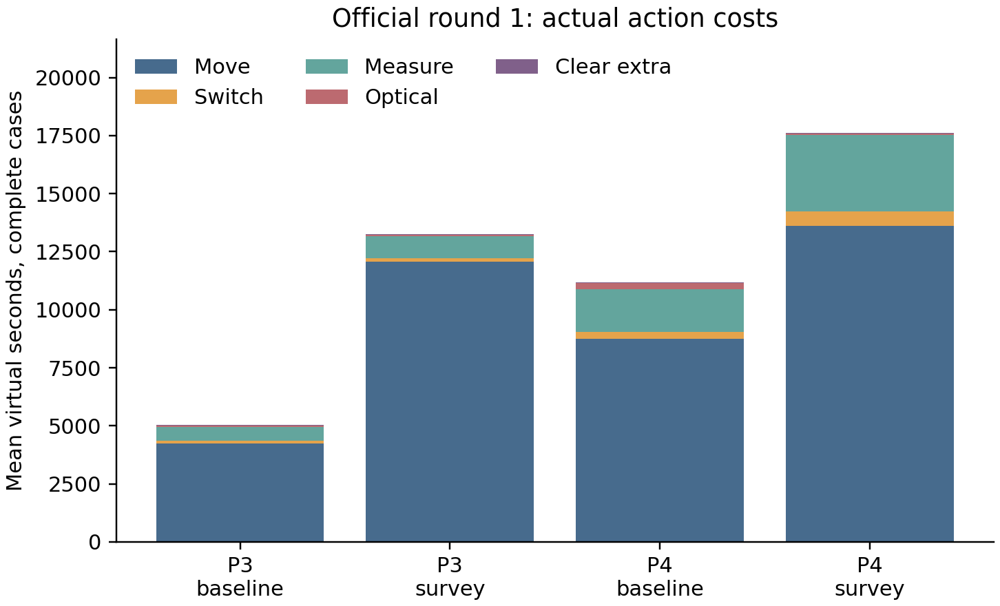

## 联合数量分布：修正支持范围，保留稀疏性

只用120局fit拟合 $P(N,N_{dir})$，不把两个边缘直方图相乘。每题60个已知联合样本，生成经验分布、总先验权重2局的平滑联合分布，以及预先定义的宽联合分布。原组成模型文件及散列固定，未根据耗时调参。

|题目|模型|开发局数|零预测概率局数|联合NLL|联合Brier|
|---|---|---:|---:|---:|---:|
|3|经验|20|0|1.9472|0.85889|
|3|平滑|20|0|1.9463|0.85854|
|3|宽联合|20|0|1.9459|0.85714|
|4|经验|20|9|非有限|0.99722|
|4|平滑|20|0|5.5733|0.99627|
|4|宽联合|20|0|4.6003|0.99012|

问题4有98种合法联合组成，60局fit仍很稀疏。9/20个开发案例落在经验分布的零概率单元中，说明直接照搬经验频率并不可靠。后续保留原先已经定义的平滑与宽联合候选；没有追调平滑权重来迎合这批结果。开发数据已用于模型选择，后续验收必须使用新官方案例。

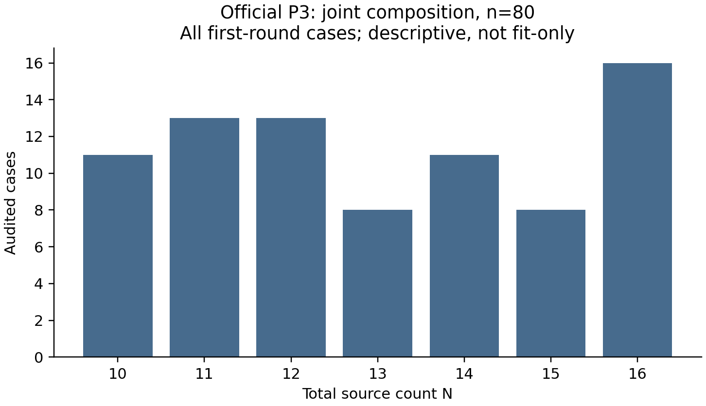

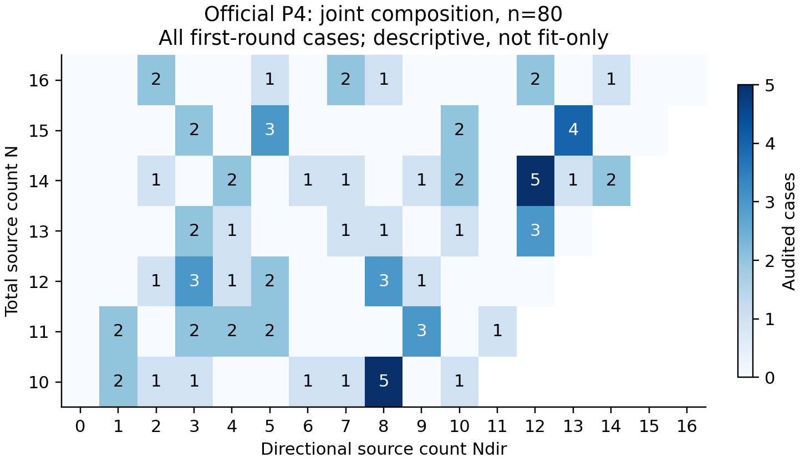

## 反馈校准：耗时接近仍可能机制失配

本地同协议实验为5组机制各160次，共800次；补充宽联合组成、混合半径、哈希误差的160次参考，只改变组成选择。960次均全清，外包真值违规为0，分别耗费309.63秒与64.01秒墙钟时间，8个CPU进程。它们是本地模拟结果，不是官方演练成绩。

全站可见性、跨站联合模式、同点与邻点反馈、外包收缩和成本分别检查。开发调查每题仅5局，因此24个“完整候选×题号×协议”统计组整体仍为证据不足；一些单项有筛查信号。原始状态保持不变，没有把不拒绝解释成模型已经验证。

一次解释性诊断发现，宽泛的“相距不超过50米”指标会掩盖标准调查中真正的1米邻点变化。严格沿用预定1米点对后，得到下列**报告角差**，它仍包含几何变化，不能直接称作真实测角误差。

|问题3标准调查|官方fit15局|官方development5局|对应本地20局|
|---|---:|---:|---:|
|平均1米邻点绝对报告角差/度|0.07683|0.06200|—|
|混合半径＋哈希误差|—|—|0.72637|
|混合半径＋150米平滑误差|—|—|0.07125|
|混合半径＋150米格点端点误差|—|—|0.09538|

哈希模型的偏差在官方fit与development都重复出现。问题3该模型的基线均值5075.15秒与官方5047.85秒相近，邻点反馈却差异很大，这直接说明“只匹配整局均值”会产生错误信心。哈希模型因此从校准池移出，仍保留在宽合法池和压力池。

问题4还存在组成混杂：官方5局开发调查的平均定向比例为39%，对应平滑组成的本地调查约67%。按已存在频道归一化不能消除这个差异，因此不能将全部可见性偏差归因于半径或误差场。

## 用位置外包构造明确反例

对真实源始终位于其中的保守外包 $P$，阳性测点 $s$ 给出 $R\ge\operatorname{dist}(s,P)$。问题3的清除前无信号测点 $q$ 给出 $R<\max_{v\in P}\|v-q\|$。这些必要条件能够直接排除特定点质量半径模型，不需要以样本均值作推断。

例如首个问题3基线案例中，一个阳性频道的保守距离下界为1156.35米，另一个清除前无信号频道的距离上界为1138.87米。因此“所有源恰为1000米”及“所有源恰为1500米”都无法解释该案例。这里没有读取精确目标坐标，也没有把清除点当成真位置。

160局得到2030条半径反例见证，0档案或计算错误。问题3的15局fit调查和5局development调查，每局都包含两种端点模型的排除证据。问题4只使用阳性距离下界，不把定向无信号当成距离排除。

另用预定邻点、位置外包和三角恒等式构造方位变化上界，核查精确±1度误差及特定150米平滑公式。40局调查、160个可评估点对中没有找到此类反例，所以它们保持未排除，而不是被认证为正确。证明、数值护栏和复现脚本见 `docs/model_witnesses.md`。

后续校准池采用平滑/宽联合组成与两种未排除误差场的组合，半径仍为1000—1500米均匀、位置仍按圆盘面积均匀、发射朝向仍均匀。这些是明确的代表性假设，尚未唯一识别。宽组成与两种保留误差场的完整交叉组合没有全部做同协议调查验证，其不确定性继续通过本地分层和新官方验证检验。

## 分阶段策略比较

阶段1冻结1000个不同场景：校准池400、宽合法池400、压力池200，两题各半。同一场景的四个策略使用完全相同的隐藏状态与固定误差场，仅将局部追加测量上限设为1、2、3、5。800个development场景用于选择，200个confirmation场景在选择前封存其性能。

实际4000次运行全部清除，外包真值违规为0；8进程墙钟996.54秒。独立重算development的3200臂、922592条请求，计数、固定误差反馈和逐动作微秒计时一致。按预定最差设计组排序，两题均选L1。选择文件及开发数据散列冻结后，仅查看确认区L1/L5的400臂；未用L2/L3的确认性能继续调参。

因此阶段1的物理执行数为4000，发布的开发/选定确认分析数为3600；另400个未选确认臂的原始结果仍保留，全清状态来自冻结运行器汇总。表中区间来自预注册惩罚耗时的配对bootstrap。此批零失败，所以其点估计等于完成耗时差；不能混用另一次bootstrap产生的区间端点。

|题|场景池／组成|开发配对数|L1−L5开发均值秒|确认配对数|确认均值秒［95%区间］|开发退步比例|
|---|---|---:|---:|---:|---|---:|
|3|校准／平滑联合|80|−460.54|20|−445.36［−540.17, −352.81］|0%|
|3|校准／宽联合|80|−451.27|20|−499.72［−585.30, −414.82］|0%|
|3|宽合法|160|−470.64|40|−467.97［−555.89, −381.85］|0%|
|3|压力|80|−181.29|20|−216.20［−283.73, −150.46］|6.25%|
|4|校准／平滑联合|80|−376.05|20|−440.36［−555.77, −322.44］|15%|
|4|校准／宽联合|80|−509.31|20|−646.33［−787.62, −492.56］|7.5%|
|4|宽合法|160|−433.07|40|−509.31［−633.74, −354.79］|11.25%|
|4|压力|80|−335.72|20|−366.93［−505.28, −201.07］|15%|

两题均通过预定确认门槛，保留L1进入下一阶段。表中每行仍是声明的合成场景设计，不是官方总体期望。校准池每种保留误差机制的开发均值也均为负；问题4其他小机制层中有4层均值为正，样本2—5个、区间跨0，不能宣称对每种机制都有收益。

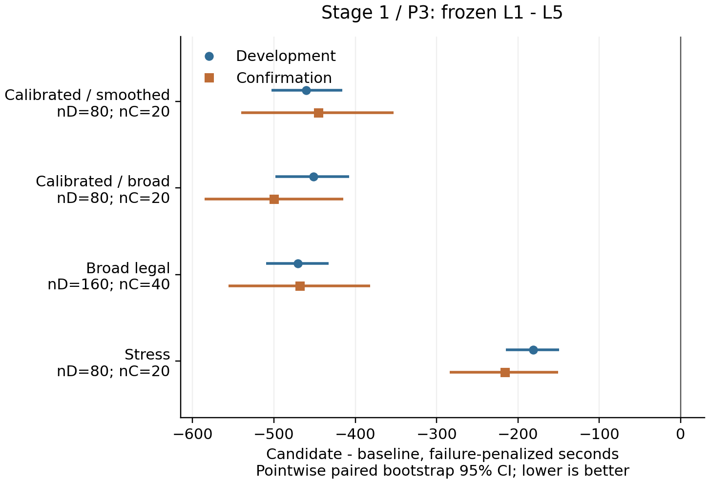

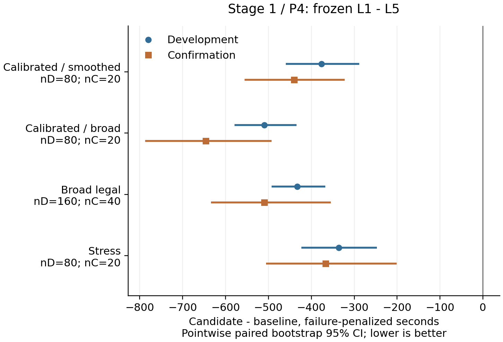

逐动作成本解释揭示了取舍：以问题4校准池平滑组成为例，L1平均移动少313.57秒、测量少171.75秒，但光学尝试多109.28秒。最差开发压力案例反而多1279.60秒，分解为移动增加900.60秒、光学增加519秒、测量减少140秒；光学兜底尝试从36增至216。首处分歧是L5继续测向、L1提前进入光学覆盖，说明少测量会把困难目标的成本转移到兜底路径。确认区还保留了一个多1739.41秒的问题4宽合法案例。它们是实际退步，不能被平均收益遮盖；完整请求、分解和路径图在 `results/round1/local/regression_diagnostics` 与各分区 `costs`。

后续阶段固定先前选择，分别只比较无信号分支选点、目标处理时机。每阶段实际使用400个新场景（校准160、宽合法160、压力80），仍按整局保留20%确认集。正式阶段2、3种子分别预先固定为2026091207与2026091307；默认阶段2种子曾用于工程测试，因此换用尚未执行的新种子，未参考策略收益。任何失败和退步均保留；若没有稳健收益，保留原模块。

开发筛选要求每个池/组成设计组的平均惩罚耗时差均为负，且没有任何机制层增加失败；按最差设计组的平均差排序，每题只冻结一个选择。确认集只用于接受或拒绝这个选择，不能换选另一个参数。新增失败、外包违规，或任一设计组的95%配对区间下界为正时拒绝该改动。通过这个门槛仍不等于证明官方收益；这些是点态探索性区间，收益验收依赖新官方案例。

阶段2实际完成640个开发运行和120个确认运行，全部全清、0外包违规，墙钟分别129.32秒与23.31秒。它保持L1及调度不变，只将观测后可能出现的direction、near、no_signal分支成本纳入测点排序。相容固定g/R/u的有限假设网格提供分支权重；它是启发式而非已校准概率后验，空网格时回退原选择器。几何外包和清除认证始终独立于这些权重，具体公式见 `docs/nosignal_sensing.md`。

问题3的两个版本在全部开发场景中虚拟结果逐例相同，保留原选择器；其确认区只运行原版本，没有构造自身比较。问题4选入NoSignal后得到下表：

|问题4场景池／组成|开发配对数|NoSignal−原选点开发均值秒|确认配对数|确认均值秒［95%区间］|
|---|---:|---:|---:|---|
|校准／平滑联合|32|−153.04|8|−131.20［−459.27, 197.75］|
|校准／宽联合|32|−192.43|8|−7.38［−313.61, 266.53］|
|宽合法|64|−88.48|16|−246.79［−523.86, 10.16］|
|压力|32|−234.86|8|−620.35［−1314.73, −10.59］|

按预定规则保留它进入后续验证，但前三个确认区间跨零，尚不能声称这些总体下有明确收益。开发退步比例37.5%—51.56%，最坏多1027.15秒。各组测量次数差均为零，收益主要来自移动与光学尝试：例如开发校准／宽联合组分别少110.08秒和82.31秒。不能把新增模块描述成已经减少测量次数，也不能用后续组合策略的全部收益替它背书。

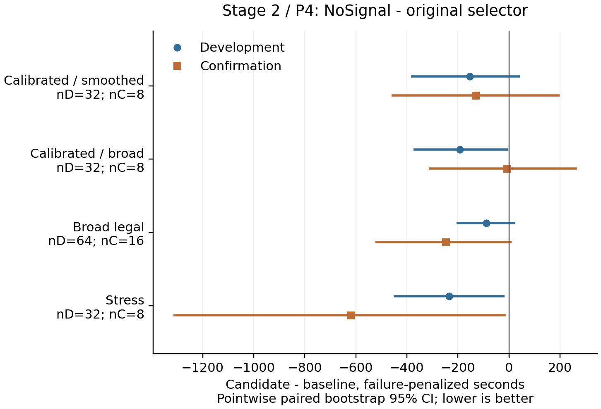

对阶段2全部760份日志的独立分类核对表明：问题4在相同局部主动测量数下，开发组平均多获得1.06—1.25次direction，确认组多0.875—2次，no_signal等量减少；平均总清除尝试也下降。不过，触发兜底的目标数并未一致下降，不能将它概括为更少触发兜底。分阶段、分池与按测量用途的完整计数在 `results/round1/stage2/measurement_outcome_diagnostics`。

阶段3只改变调度，实际开发960次、确认80次均全清且无外包违规，墙钟分别182.13秒和18.24秒。立即处理在各设计组比joint平均多934—2177秒（问题3）或1458—1969秒（问题4）；全扫后处理平均多14—620秒（问题3）或442—854秒（问题4）。16项设计组比较中15项95%区间下界大于零，唯一跨零的是问题3压力池的全扫后处理，均值仍多14.48秒。按规则两题均保留joint，确认区只运行保留策略本身，不构造调度改进。

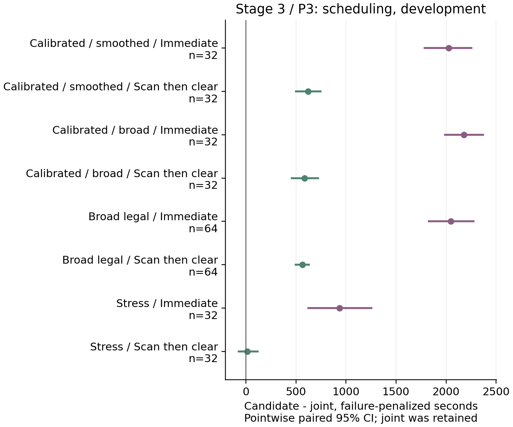

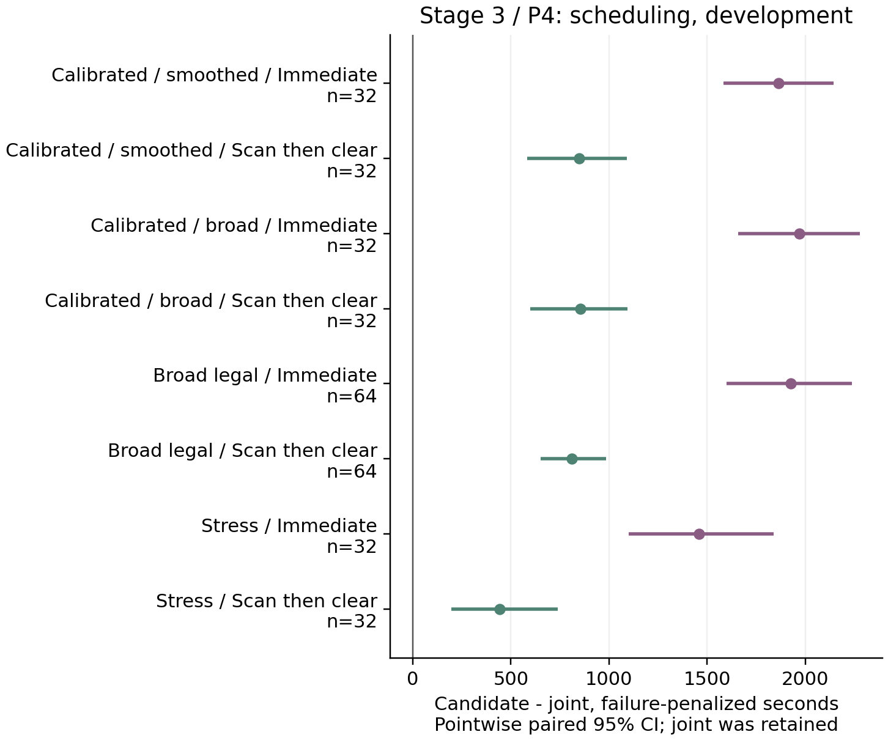

最终组合为问题3的L1＋原选点＋joint，以及问题4的L1＋NoSignal＋joint。三阶段合计1800个不同世界、5800次物理策略运行；加960次同协议检查，主要本地实验6760次均全清。批次墙钟合计1723.16秒，不含官方运行、统计分析和独立审计。独立逐动作审计覆盖已发布的5400次策略运行、1555327条动作，未覆盖未用于选参的400个阶段1确认臂；后者仍保留冻结运行器的可靠性结果。四次真实冻结候选CLI本地冒烟另计，覆盖两题N=10/16，全部全清；最终完整测试为276项通过，实际耗时33.17秒。

## 新官方验证与复现边界

新官方验证在候选与样本量冻结后进行，按题号分层、两臂随机块交错分配。官方不能复位同一案例，因此不使用配对置信区间。未完成案例不能将退出前的短耗时当完成时间。

在查看阶段1性能或开启任何新官方案例之前，将希望辨别的幅度设为5%（实现时的研究选择，并非用户指定值）。依据首轮各60局基线方差，正态近似需要每臂问题3约69局、问题4约48局；受每题最多60局的预算约束，本轮均冻结为每臂30局。对应近似功效仅为45.8%与60.4%，80%功效下可辨别幅度约7.55%与6.30%。因此预算内的无显著差异不能证明两个策略等效。精度决定保存在 `results/round1/validation_precision_decision.json`；候选与全部依赖散列确认后，以种子2026091159生成每块2基线/2候选的随机分配，两题交错执行。

首批8局只检查接口、日志和操作完整性，全部通过，随后继续原定112局；前8局仍包括在总120局内。一次登录过期发生在启动任何新案例或机器人动作之前，恢复后继续原分配，作为0案例/0请求的局前事件保存。实验未按中途效果停试、换参数或扩充样本。

全部120局均已执行，官方结束统计与策略清除数相符，没有缺失N或Ndir。主结果采用预定的分题独立分臂bootstrap，5000次、种子92117；下面的95%区间取完成耗时字段，不把另一次惩罚耗时bootstrap的端点混用。

随后独立审计120局的34,861条唯一accepted动作，其中27,005次测量、7,616次清除尝试、1,542次成功清除，0审计问题。状态机、去重、停止证据、原日志字节和冻结代码一致；逐响应与本地状态计时的最大差约0.00000699秒。证据在 `results/round2/integrity_final/overall.json`。本轮两阶段官方演练共280局、88,820条请求，第一版4局另计。

额外公开证据审计核对界面摘要与结束弹窗的全部源数：1542个源中1149全向、393定向。109局依据逐频道完整覆盖证书退出，11局已成功清除16个不同频道而达到题设上界；120份原始官方加密日志均与副本散列相符。官方审计仅检查公开反馈及证据一致性，没有读取隐藏精确位置，因此不能把“0审计问题”改称官方真值外包检查0违规。

|题目|基线全清/局数|候选全清/局数|基线均值秒|候选均值秒|候选−基线秒［95%区间］|
|---|---:|---:|---:|---:|---|
|3|30/30|30/30|5043.29|4400.64|−642.65［−826.29, −452.42］|
|4|30/30|30/30|11371.88|10663.89|−707.99［−1117.47, −264.38］|

对应点估计为平均整局时间降低12.74%和6.23%。本轮没有失败，固定360000秒失败惩罚的敏感性点估计与上表相同；两题的惩罚耗时区间也全部低于零。每臂0/30失败的95% Wilson区间仍为0—11.35%，不能使用退化为［0,0］的经验失败率bootstrap声称总体无失败风险。几何完整性证明与有限样本的软件运行可靠性证据分别陈述。

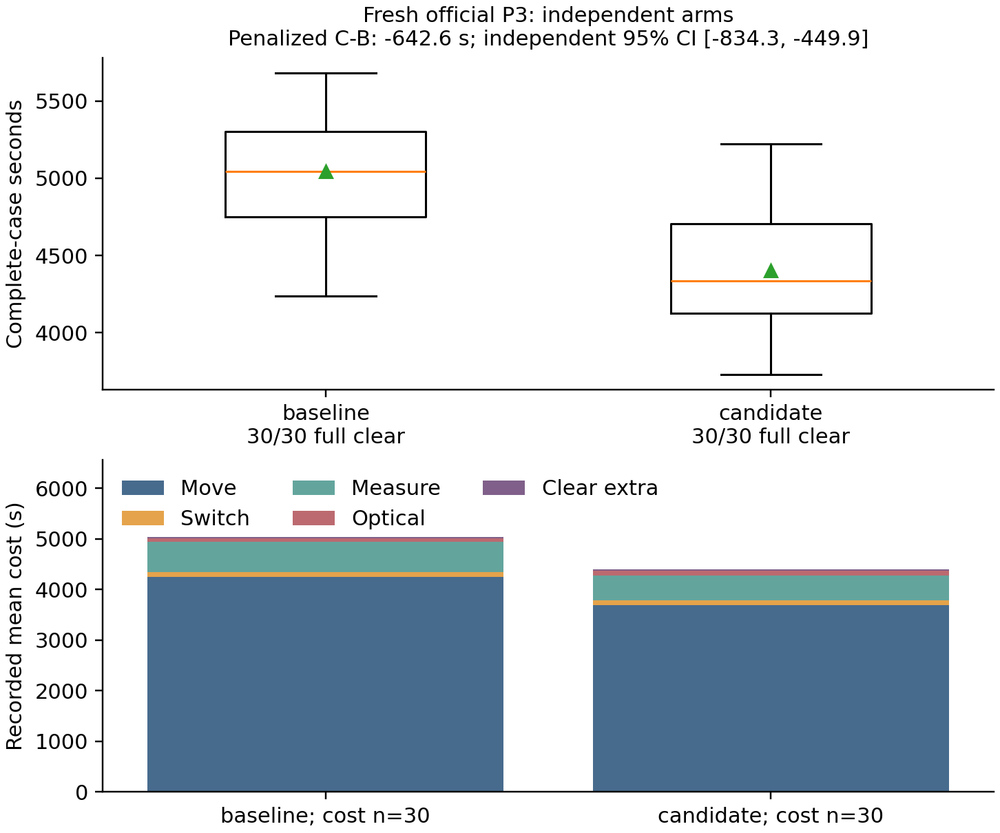

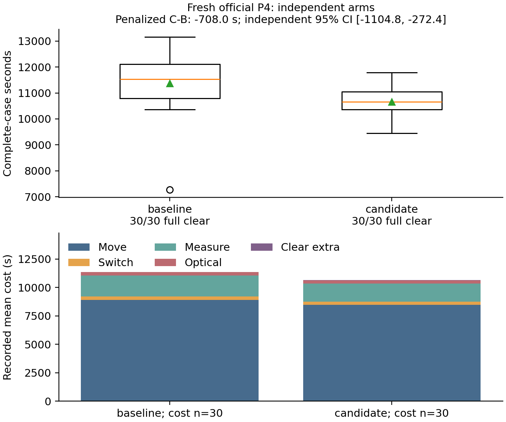

|实际平均量|问题3基线|问题3候选|问题4基线|问题4候选|
|---|---:|---:|---:|---:|
|移动米|21241.77|18492.54|44593.24|42318.28|
|测量次|120.87|97.33|366.00|315.97|
|切频道次|91.07|95.17|306.87|292.20|
|清除尝试次|24.33|31.63|97.10|100.80|
|成功清除数|13.27|12.70|12.53|12.90|
|失败清除次|11.07|18.93|84.57|87.90|
|平均定位清除秒/源|386.19|351.44|924.29|844.02|
|程序现实运行秒|2.50|1.84|5.61|4.04|

题目要求的平均定位清除时间按每局总虚拟时间除以该局成功清除数，再对局求均值；它不是优化目标，也不等于两个组均值之比。程序时间为求解进程墙钟，不含界面开局/导出和分析排版。逐局实际案例编码、全部指标与原始日志对应关系见 `results/pipeline_summary/official_validation_cases.csv` 及 `results/round2/cases`。

按实际动作分解，问题3的平均差为移动−549.85秒、测量−117.67秒、切频道+4.10秒、光学尝试+21.90秒、成功清除追加项−1.13秒；问题4分别为−454.99、−250.17、−14.67、+11.10、+0.73秒。两个总和与整局差值一致，余差只来自接口逐动作舍入。因此迁移收益的主要来源是移动和测量，不能写成官方失败清除减少。问题4最终比较同时包含L1及NoSignal，不能将全部707.99秒归因于NoSignal一个模块；其增量证据仍以本地阶段2单因素比较为准。

随机分配没有保证这批案例的组成完全相等。问题3基线/候选平均N为13.27/12.70；问题4为12.53/12.90、平均Ndir为7.07/6.03、平均逐局定向比例为56.67%/47.05%。本轮主分析保持预定的随机化独立比较，没有看到结果后改用有利的校正方法。这些实际不平衡意味着点估计包含有限样本的组成波动，不能声称已经估计每种组成下的固定收益。

|描述性尾部|问题3基线|问题3候选|问题4基线|问题4候选|
|---|---:|---:|---:|---:|
|样本P90秒|5639.19|4862.37|12451.71|11254.32|
|样本最大秒|5680.56|5223.68|13157.59|11780.68|

两题候选的样本P90和最大耗时均较低，但每臂只有30个不同官方案例，不能从中构造“同一个困难案例改善了多少”，也不能认证最慢5%的总体表现。本地已经观察到的+1279.60秒、+1739.41秒等退步仍保留，不能被这次官方总体收益抹去。

本轮支持的结论是：在保留原几何与完整搜索机制的条件下，冻结的两个候选在这次预定新官方演练中降低了整局平均虚拟时间。它不要求本地唯一恢复官方生成器，也不意味着全部同协议统计检查已经通过。当前可保留这两个候选用于后续应用；若再开一轮，应优先补充问题4组成与多方位可见性的匹配调查，并复核光学兜底变贵的局面，而不是直接扩大参数搜索。没有自动追加新的官方案例或消耗正式机会。

部署与恢复命令见 `docs/round1_deployment.md`。本轮使用本地CPU多进程，没有分配Inspire实例或调用模型API参与在线动作。并行资源用于独立场景对照，不能消除几何不可识别性，也不能直接缩短官方虚拟移动时间。

所有统计比较都是针对记录下来的采集协议和声明的模型。有限样本零失败不证明总体零失败，缺少反例不证明全部隐藏状态联合可行。六次正式测试仍未执行，不能用本轮演练或本地数字代填正式成绩。
