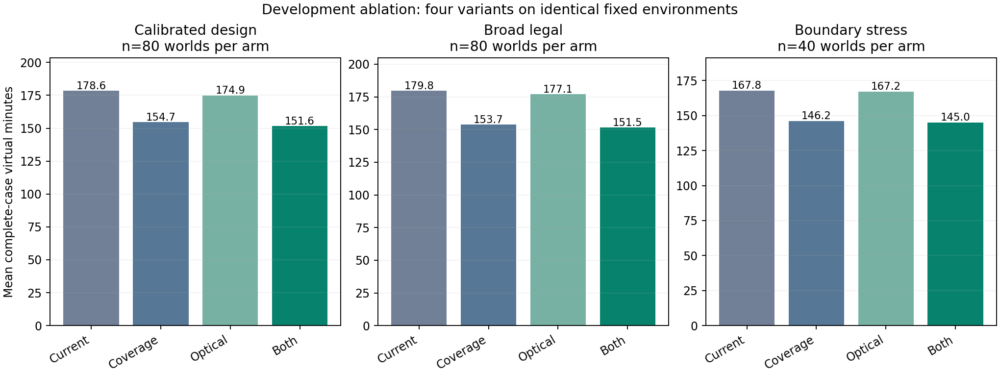
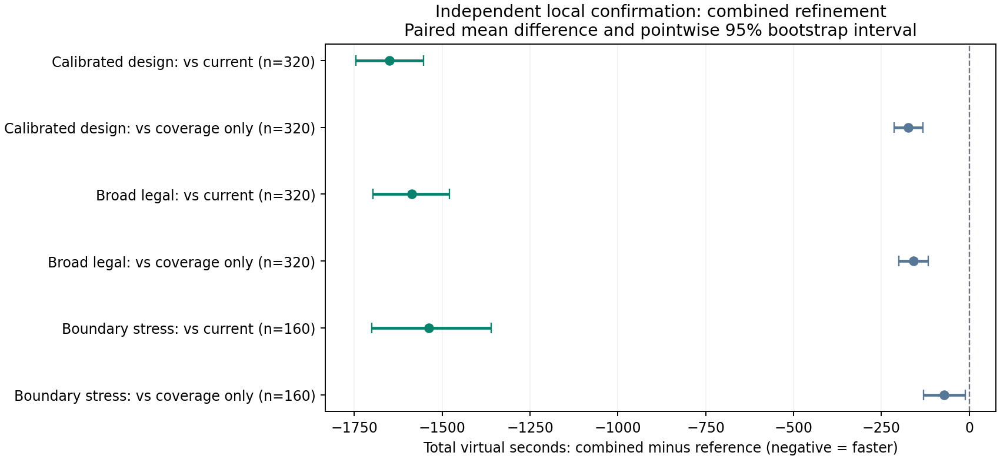

# P4第二轮迭代：覆盖路线与当前区域光学覆盖

本轮全部为实际执行的本地模拟。官方新增演练0局、正式测试0局。比较基准是上一轮P4候选（NoSignal、L1、joint），不是更早L5基线。

## 第一性原理与实际改动

未发现频道需要覆盖位置与朝向的完整性证据；已发现目标需要从当前认证外包出发付出尽可能少的剩余清除成本。尾部时间和兜底次数均只作诊断，完整整局虚拟时间仍是优化指标。

1. 覆盖：31站/29890.897米改为25站/24095.424米。995米近等边三角格、平移相位3/24与18/24；所有与外扩目标圆盘相交的闭三角形顶点全部保留，整数精确谓词及实际float坐标余量保证连续域可见。静态路线减少19.39%，不声称所有覆盖的全局最优。
2. 局部：L1测量规则保持，用当前外包P重建边长28米光学网格，实际提交中心逐格验证半径小于20米；比较覆盖方向和蛇形/近邻路线。失败仅能剔除整块支持集被一个已失败清除圆覆盖的格。
3. 可选adaptive实现有单元测试，但未纳入本轮批量与性能结论。对无信号仍保留P的候选测点，不能用近似路线界的松紧声称信息有价值。

完整推导见[p4_refinement_principles.md](p4_refinement_principles.md)、[覆盖证明](refined_coverage.md)、[局部证明](refined_local.md)。

## 预先固定的实验设计

200开发世界×4臂=800次运行；开发后按预定规则选出组合与仅覆盖对照，800个独立确认世界×3臂=2400次运行。合计1000个主世界、3200次主运行；另有6世界24次冒烟。各臂共享隐藏环境与固定误差场，真值仅由环境和事后评估器读取。

开发要求全清且外包违规为零，并要求每个池的平均惩罚时间不高于current，再按校准池平均时间选择主候选。确认不重新调参，不强行合并三个池为官方预期表现。

## 开发消融：平均整局虚拟秒

|场景池|每臂世界数|current|仅覆盖|仅光学覆盖|组合|
|---|---:|---:|---:|---:|---:|
|校准设计池|80|10713.01|9280.86|10494.12|9096.92|
|广覆盖合法池|80|10786.54|9222.60|10626.04|9089.35|
|边界压力池|40|10067.74|8770.63|10029.33|8702.78|

## 独立确认：平均整局虚拟秒

|场景池|每臂世界数|current|仅覆盖|组合|组合降幅|
|---|---:|---:|---:|---:|---:|
|校准设计池|320|10751.39|9274.36|9100.84|15.35%|
|广覆盖合法池|320|10688.07|9258.82|9101.06|14.85%|
|边界压力池|160|10268.83|8803.46|8731.63|14.97%|

|配对对比：组合减参照|场景池|平均差值秒|点态95%区间|退步例数|最坏退步秒|
|---|---|---:|---|---:|---:|
|上一轮P4候选|校准设计池|-1650.55|[-1745.74, -1553.27]|11/320|2709.64|
|仅25站覆盖|校准设计池|-173.52|[-213.09, -131.92]|86/320|1123.69|
|上一轮P4候选|广覆盖合法池|-1587.02|[-1696.61, -1479.32]|12/320|2846.10|
|仅25站覆盖|广覆盖合法池|-157.76|[-200.54, -117.30]|92/320|909.24|
|上一轮P4候选|边界压力池|-1537.21|[-1699.96, -1359.86]|8/160|3611.07|
|仅25站覆盖|边界压力池|-71.83|[-129.61, -11.07]|53/160|991.46|

区间来自固定本地分层设计内的配对bootstrap；不是官方总体置信区间，未作多重比较校正。组合相对仅覆盖的差值用于解释局部组件的增益。

## 确认成本与平均定位清除时间

|池/策略|平均T/N秒|移动米|检测|换频|失败清除|尾部秒|程序现实秒|
|---|---:|---:|---:|---:|---:|---:|---:|
|校准设计池/上一轮P4候选|854.37|42272.83|327.93|305.24|95.88|737.05|3.96|
|校准设计池/仅25站覆盖|735.36|36290.72|281.70|264.85|92.87|367.82|3.80|
|校准设计池/两项组合|721.67|35632.99|281.75|264.89|78.78|363.91|4.35|
|广覆盖合法池/上一轮P4候选|821.15|42366.14|316.56|293.98|90.52|828.54|3.86|
|广覆盖合法池/仅25站覆盖|711.25|36484.25|274.14|257.36|89.12|342.61|3.76|
|广覆盖合法池/两项组合|699.11|35876.73|274.14|257.36|77.04|331.56|4.37|
|边界压力池/上一轮P4候选|785.03|40805.95|316.76|293.58|54.41|760.72|3.32|
|边界压力池/仅25站覆盖|671.79|34554.85|275.17|257.74|63.96|516.96|3.35|
|边界压力池/两项组合|666.10|34279.29|275.17|257.75|58.38|511.09|3.82|

|场景池|current每源≥900秒|组合每源≥900秒|current每源≥1000秒|组合每源≥1000秒|
|---|---:|---:|---:|---:|
|校准设计池|111/320|19/320|51/320|2/320|
|广覆盖合法池|85/320|15/320|33/320|2/320|
|边界压力池|38/160|6/160|17/160|0/160|

## 退步案例保留

每池列组合相对current最差的三例。正差值表示退步；不因平均改善而删除。

|案例|N/定向|current秒|组合秒|差值秒|移动增量米|检测增量|失败清除增量|
|---|---:|---:|---:|---:|---:|---:|---:|
|p4-refinement-confirmation-round-calibrated-p4-0210-8b1075dacb629cb3|16/7|7081.47|9791.11|2709.64|11483.19|43|55|
|p4-refinement-confirmation-round-calibrated-p4-0149-7fbb4f9a5f1e77ef|16/0|7157.85|8936.35|1778.50|9067.51|1|-12|
|p4-refinement-confirmation-round-calibrated-p4-0118-1d2a4b20f6296987|16/2|7431.25|9022.48|1591.23|7781.15|-4|21|
|p4-refinement-confirmation-round-broad-p4-0089-a18edfabaad9eda7|16/9|6943.32|9789.42|2846.10|10925.48|85|52|
|p4-refinement-confirmation-round-broad-p4-0175-5363798f46f5841a|16/7|7417.89|10084.45|2666.56|11282.79|52|35|
|p4-refinement-confirmation-round-broad-p4-0135-61d537cc237b0e58|16/2|6934.97|8516.83|1581.86|7674.30|17|-16|
|p4-refinement-confirmation-round-stress-p4-0155-2db84a1de96f5e5a|16/11|6222.94|9834.00|3611.07|14475.33|86|69|
|p4-refinement-confirmation-round-stress-p4-0016-6e86c39edbafa81d|16/2|4777.07|7534.30|2757.24|12276.19|52|0|
|p4-refinement-confirmation-round-stress-p4-0143-fa1cf5a2e7fe87e6|16/14|5818.31|8574.65|2756.34|10846.72|18|160|

## 退步机制与下一轮因素

另对开发集每池最差世界的四臂日志进行了逐动作重建，共12次运行、3147条已接受的检测/清除动作；时间残差不超过3.46e-11秒，文件散列、可见性和800米延期规则均吻合。它们是事后选择的极端案例，用于解释机制，不是新的验证样本。

1. 完整路线短不意味着更早完成：开发合法池最差例旧策略访问16/31站便清除16源退出，新策略访问25/25站；压力池相应为15/31和25/25。路线同时改变了首次发现、局部测点与清除顺序。
2. 处理顺序存在可改进之处：开发压力最差例，频道3在新路线第18站已被发现，随后成为唯一未清除目标；公开外包计算的顺路额外距离约1285.66—3098.58米，始终超过800米固定阈值，因而被推迟到全路线扫描结束。该行为符合现有程序，但未充分利用已发现16个不同频道的信息。
3. 覆盖格数少不意味着首次命中早：同一新路线下，该压力例频道1的追加测量均为no_signal。旧110格方案第16次尝试命中，新80格方案第66次才命中。优化完整覆盖成本上界仍不能逐案例保证首次命中更快。

下一轮应将处理顺序作为独立因素：已得到16个不同频道的阳性证据后，优先清理这16个目标，仍必须实际获得16次成功清除才能退出；其他状态比较立即服务与继续扫描的剩余时间，而不只用固定800米阈值。随后单独研究光学搜索的首次命中顺序。两项尚未实现或验证，不能算作本轮收益。任何经验优先级均不得删减最终覆盖与清除证据。

细节与原始日志索引见[开发退步诊断JSON](../results/p4_refinement_diagnostics/development_regressions.json)，可运行 `scripts/diagnose_p4_regressions.py` 复现。

## 验证、限制与复现

全部3200次主运行完整清除；另24次冒烟完整清除。322项完整测试通过。三份独立审计均为0问题，按原始请求检查了计时、频道、位置、成功数、覆盖点与逐频道停止索引、外包真值包含及文件散列。

开发使用8个进程，墙钟349.11秒；确认使用16个进程，墙钟684.83秒。程序现实时间受并发与机器负载影响，不和官方程序时间直接比较。

经验性收益目前限于这些本地相容环境与压力场景。不能把本轮降幅直接加到先前官方6.23%上，也不能据此填写新官方成绩。完整性证明与浮点余量针对指定物理/误差模型；现实时间和网络故障仍需要运行时预算管理。

下一步应冻结入选方案，用新的官方独立案例随机交错比较current和组合；如收益不迁移，检查可见性、测向收缩、搜索轨迹和清除成本的具体失配，不直接扩大参数搜索。正式测试继续保留原授权边界。

复现命令见[p4_refinement_reproduce.md](p4_refinement_reproduce.md)。全部主数据位于 `results/p4_refinement`，审计、图及综合JSON位于 `results/p4_refinement_diagnostics`。
