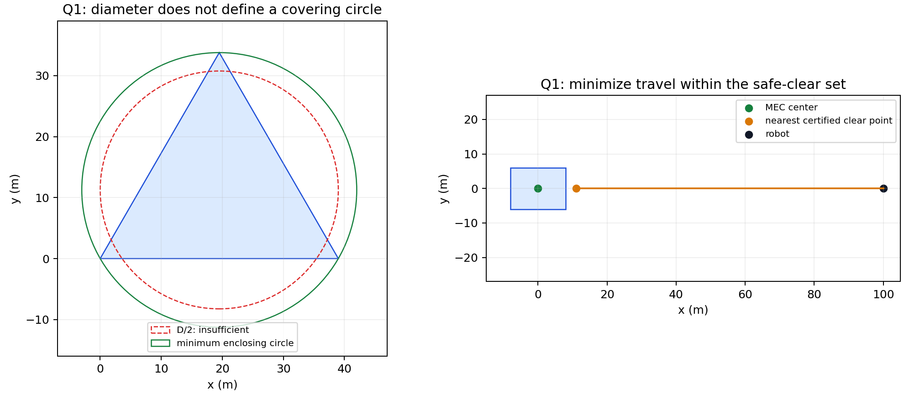
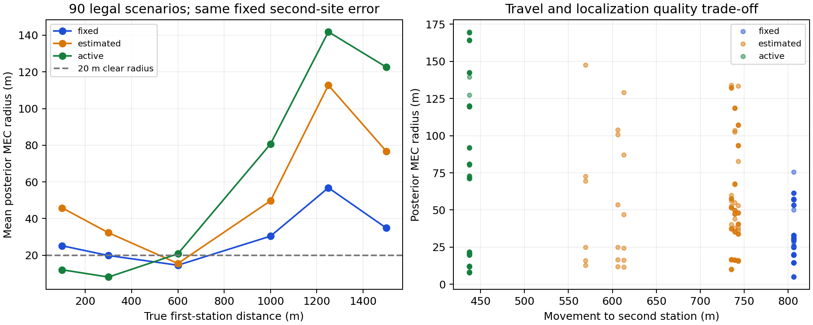
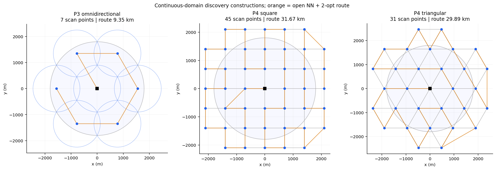
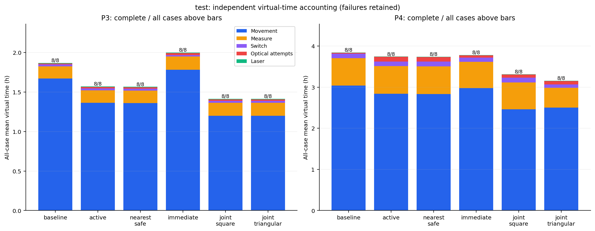
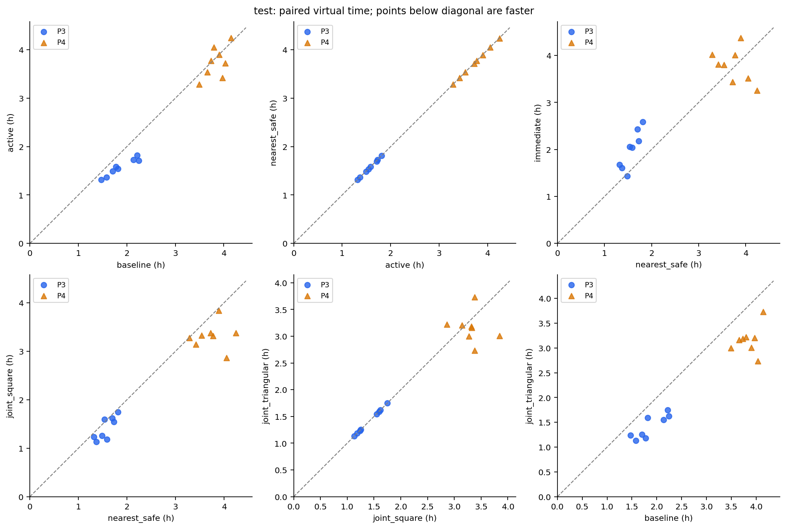
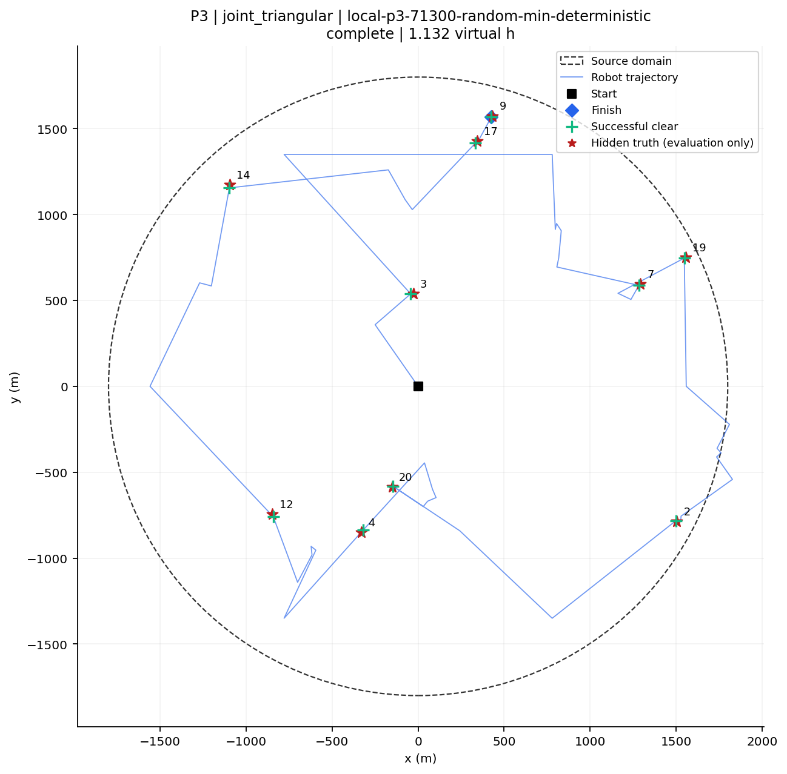
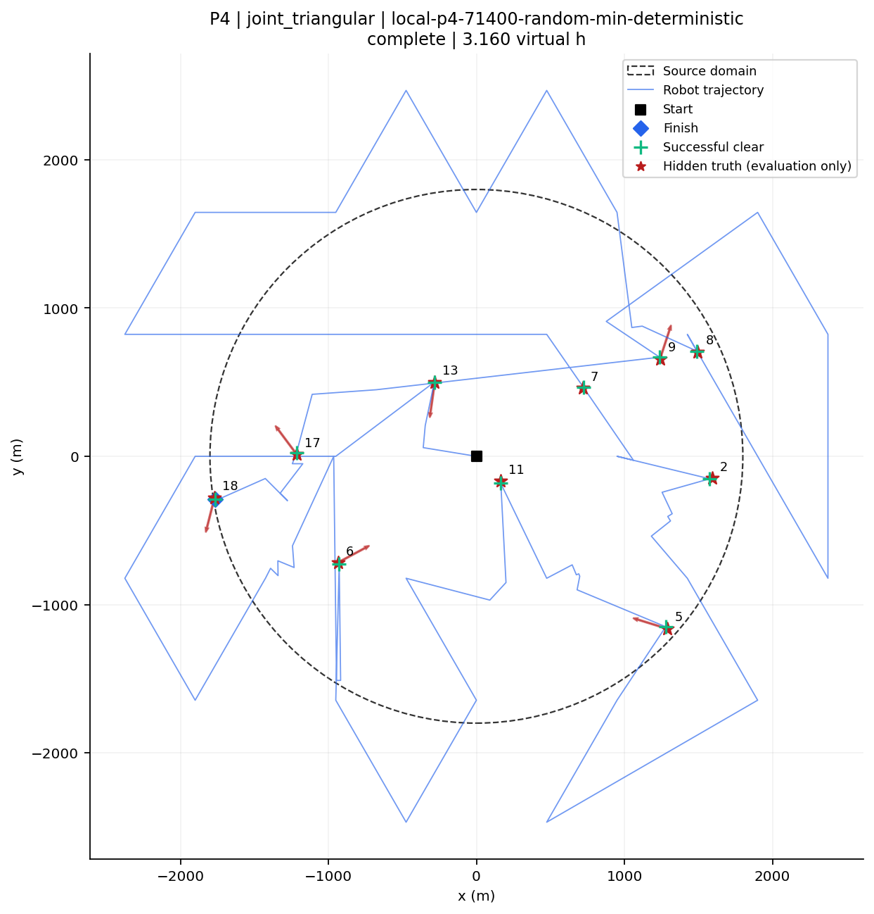
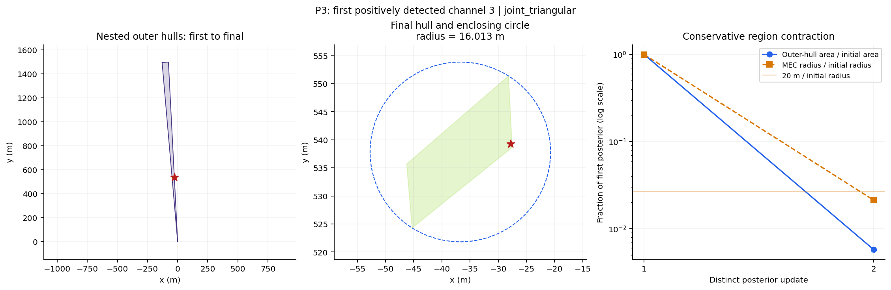
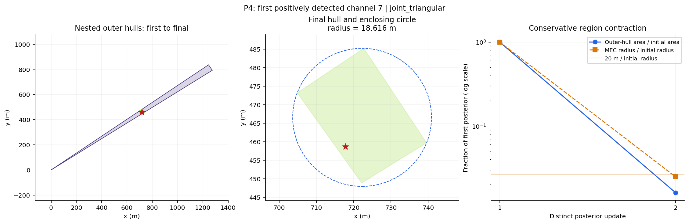

# 无线电干扰源的快速自动定位与清除

## 基于有界误差外包、确定性发现覆盖与有限光学兜底的单机器人策略

研究完成日期：2026年9月11日。本文为已实现、已执行实验的研究正文。问题3、4各三次正式测试尚待用户授权；演练结果与自建环境结果分别列出。本文不含参赛队号、密码或未经执行的正式成绩。

## 摘要

本题的主要困难不是从带误差的示向度算出一个估计坐标，而是在目标数量、接收半径以及部分目标发射方向未知的条件下，给出不会漏搜、能够清除并能检查停止理由的完整程序。本文将任务分为发现完备性与局部清除完备性两个相互衔接的命题，并以成功清除全部目标为首要约束，以总虚拟行动时间为次要目标。

对问题1，将方向误差区间转换为前向半平面交，提供空集、无界集、线段、单点和有界多边形的分类算法；证明凸多边形直径可由顶点对取得，并用边长39 m的等边三角形否定“直径小于40 m即可一次清除”。实际清除采用外包集合的最小包围圆与最近安全清除点的双重距离核验。对问题2，建立1000 m保证接收区，以及利用首次阳性观测所含位置—半径关系得到的凸扩张；用连续报告角分箱评价有限候选点，明确几何半径上界与时间启发式评分的差别。

对问题3，证明原点与半径900√3 m六点环能够以不超过900 m的距离覆盖整个目标圆盘。对问题4，通过凸包条件和闭胞元顶点构造，证明700 m方格及950 m等边三角网格对所有位置、全部发射朝向均能发现目标；保留圆盘外顶点，处理朝外边界目标。对已发现目标，最多进行5次主动测向，再由110个光学点覆盖首次方向约束带，从而保证有限清除。实际策略的保守虚拟时间界为65.157 h，低于100 h上限，但不据此承诺任意网络条件下满足现实期限。

实现仅使用Python标准库完成在线计算。97项测试通过；冻结版本的32个自建案例在6种策略下共192次运行全部清除，逐次外包检查没有排除真实源。在独立测试集上，完整策略相对固定基线的问题3、4平均总虚拟时间分别减少约24.31%和17.90%。四次官方演练分别达到15/15、11/11、16/16和14/14，原始请求、响应、界面证据与加密行为日志均保留。主动测点并不在所有场景中改善两次测量精度，联合调度也不是路线全局最优；本文将这些实验结论与确定性保障分别陈述。

关键词：有界误差定位；计算几何；最小包围圆；定向覆盖；在线调度；幂等接口

## 1 问题重述、材料依据与基本原则

原题要求一只机器狗从原点出发，在半径1800 m的圆域内发现并清除10至16个干扰源。源之间频道互异，频道取1至20；尚未收到某频道不代表该频道有目标。每源有效接收半径固定在1000至1500 m之间。全向源可以从任何方向接收；定向源只在以自身为顶点的闭180°半平面内辐射。机器狗可以走出目标分布圆盘，无障碍物和运动碰撞约束。

本文直接核对原始4页题面、附件1《模拟器使用说明》和附件2通信协议，并比对ZIP中的原件。材料校验值、全文抽取和页图保存在sources。前期analysis文件未作为题设依据。特别注意：题目背景中的场强描述不等于接口提供RSS。在线策略只获得direction、near、no_signal以及清除成功与否，没有距离、强度、类型、朝向或未清除总数查询接口。

题目需要分别解决三个逻辑问题：哪些状态还可能真实？执行什么动作才有清除保证？何时才有“剩下没有目标”的证据？单纯拟合误差小、坐标变化小或连续多次无信号，都不能回答后两个问题。本文先维护包含真实状态的外包，再优化动作顺序；任何预算或协议故障都报告不完整，不以较小的平均时间掩盖漏清。

### 1.1 题设事实与代码对应

| 事实 | 数学表达 | 接口/代码表现 | 原始依据 |
|---|---|---|---|
| 源在圆盘内，机器人可出界 | ‖g‖≤1800；s不受该圆限制 | position为平面坐标；每分量绝对值≤2000000 | 题面p1；附件2§1.1 |
| 频道唯一、数量未知 | f∈{1,…,20}；10≤N≤16 | 20份独立知识账本，不能读总数 | 题面p1、p2附录1；附件2§1.3 |
| 半径固定未知 | 1000≤R_f≤1500 | 多次观测共享同一R_f | 题面p3；附件2§2.1 |
| 定向半平面含边界 | u_f·(s−g_f)≥0 | no_signal包含朝向不可见这一分支 | 题面p2；附件2§2.2 |
| 示向方向是测点指向源 | arg(g−s)，东0°北90° | 只在direction时读svd_deg | 题面p2图1；附件2§1.2、§2.3 |
| 同点误差固定，误差有界 | e_f(s)∈[−1°,1°] | 重复同点不平均收窄；模拟器误差场固定 | 题面p2；附件2§2.3 |
| near是可见且≤5 m | visible且‖s−g‖≤5 | near后原地clear | 题面p3；附件2§2.4 |
| 光学清除不依赖发射朝向 | ‖z−g‖≤20 | accepted的失败clear也改变位置 | 题面p3；附件2§8.2 |
| clear不改变测向频道 | c下一步=c当前 | 仅measure的channel更新调谐状态 | 附件1§2.3；附件2§1.4 |
| 两个时间预算分别计算 | 虚拟T与单调墙钟t | enter返回实际剩余时长，预留退出时间 | 题面p4；附件1§2.5 |

完整字段、错误码和逐项来源表见facts_and_api.md。此处p表示原始题面PDF页码，不是本文页码。

### 1.2 假设与歧义处理

模型不引入独立高斯误差。不同位置的误差可以相关、突变或接近界限，只要求固定点重复不变并满足声明的误差界。本地环境的哈希固定误差、平滑相关误差和分块极值误差是压力测试机制，不声称是官方生成规律。

接口明确返回两位小数，但“±1°是否已包含最终量化”没有单独展开。主实现按通常的最近舍入解释，保守取ε=1°+0.005°+0.0001°=1.0051°，分别对应物理界、半个量化单位和额外角度护栏；如果±1°已经是最终读数误差，这一配置只是放宽。如果采用截断而非最近舍入，0.005°不能作为完整量化界，应改用不少于0.01°的量化余量。本文另运行ε=1.02°、1.06°敏感性实验；保证依赖所声明量化解释，不能把1.0051°写成官方精确规定。

几何中的长度容差与角度余量分别管理。圆域采用外接多边形；清除工作半径设19.999 m，并对实际提交坐标按20 m再次核验，留下至少微米级算术保护。证明首先在实数模型下成立，浮点实现采用向外放宽和测试审计；本文没有给出整个Python程序的形式化机器证明。

## 2 统一隐藏状态与信息更新模型

### 2.1 隐藏状态、公开状态与动作

每频道f的初始隐藏状态为存在性E_f、位置g_f、半径R_f、类型τ_f，以及定向时的单位方向u_f。清除状态C_f随已接受的clear改变。未知参数在同一局内固定。全局公开状态包括机器人位置s、当前测向频道c、已经确认执行的请求历史H、逐频道覆盖点索引集合A_f、已用虚拟时间T和剩余现实时间。

合法动作只有enter、measure(f,q)、clear(f,q)、exit。移动由measure或clear的目的坐标隐含实现，不能中途连续测量，也不能独立发切频道命令。策略对象只持有客户端和这些公开状态；源真值留在本地环境中，评价器只在策略运行后读取它。官方执行全过程没有读取目标数据、解密行为日志或检查模拟器实现。

定义可见性V_f(q)=E_f且未清除且‖q−g_f‖≤R_f，定向源还要求u_f·(q−g_f)≥0。接口一次响应排除的状态如下。

| 响应 | 对仍存在源的约束 | 是否能立即认证清除 |
|---|---|---|
| direction，读数θ | V_f(q)；‖q−g_f‖>5；角度差≤ε | 通常不能，需与既有约束相交 |
| near | V_f(q)且‖q−g_f‖≤5 | 能，在q清除 |
| no_signal | 源不存在、已清除、距离超限、或定向背面之一 | 不能 |
| clear失败且accepted=true | 未清除目标不在闭20 m圆内 | 不能；移动已执行 |
| clear成功且accepted=true | 目标原位置在闭20 m圆内，之后已移除 | 能，成功响应为最终确认 |

对全向且确定未清除的源，no_signal意味着‖q−g‖>R≥1000；可保守排除闭1000 m圆。对问题4则不能删除这整个圆，因为朝向也能解释无信号。阴性信息必须与同一R、同一u及历史阳性信息联合解释，不能每次临时选择一套参数。

### 2.2 前向角度集合与外包不变量

给定测点s、读数θ，令u_−=(cos(θ−ε),sin(θ−ε))、u_+=(cos(θ+ε),sin(θ+ε))。当0≤ε<90°时，前向扇区W由三个线性不等式表示：

cross(u_−,g−s)≥0；cross(u_+,g−s)≤0；u_θ·(g−s)≥0。

前两项限制角度，第三项明确前向半平面；ε=0时也不把射线误作整条直线。程序使用向量和叉积，不对359°至1°的区间作错误的普通实数排序。注意发射可见性中的向量是s−g，与示向向量g−s正好相反。

精确状态集K_f由上述全部约束构成。其位置投影减去阴性或清除失败排除圆后可能非凸、有孔或分裂。主实现维护凸外包H_f，并另存所有观测、半径约束和清除失败点的符号账本；compatible_hidden_state可检查某一固定候选状态是否符合完整历史。在线清除只使用凸外包，不声称该包络已精确消化所有阴性信息。这样会丢失效率，却避免用粒子或离散采样替代包含保证。

初始H_f是目标圆的128边外接多边形。direction时与W及1500 m接收圆的96条切线半平面相交，near时与5 m圆外包相交。圆半径R的正n边形顶点半径取(R+δ)/cos(π/n)，而不是R。若初始g∈H且真实约束包含于实际外扩约束H_new，则交集仍包含g；对真实历史归纳，得到g始终位于H_f。阴性信息暂不裁掉包络不会破坏这一包含关系。

每条阳性更新都检查非空性。空包络不是成功证据，而是误差假设、接口状态或数值实现不一致的信号；程序写入失败日志并结束未完成任务。外部本地评价器逐事件核对真源是否仍在外包中，不能让策略利用这个核验读取真值。

### 2.3 目标函数与统计指标

采用词典序目标：先要求全部真实目标被发现并成功清除，再最小化总虚拟时间，同时遵守现实期限。令L为实际路径长度，S为检测引发的频道切换次数，M为检测数，A为全部光学清除尝试数，K为成功清除数，则

T=L/5+S+5M+3A+2K。

定义统计量清除比例K/N和平均定位清除时间T/K，K=0时后者未定义，记为空值。程序停止条件、优化目标和统计量是三件事。正式测试不给N时保留空分母，不能以推测数量填清除比例。实验表对失败案例也保留运行耗时，不能只挑成功案例计算漂亮均值。

## 3 问题1：交会区域直径与安全清除位置

### 3.1 完整交会算法

仅由方向构造的交会区域是P_angle=∩W_i；加入已知目标域和阳性距离上界后的区域P_prior通常更小。前者可以无界，后者在非空时有界。题面图2画出的四边形不是所有输入都会得到的形状，也不一定中心对称。

算法先转换每条方向为半平面a_i·x≤b_i。对仅角度区域，枚举原点、原点在每条边界的正交投影以及每对非平行边界的交点，检查全部约束以判断可行性。其完备性来自原点到非空闭凸集合的最近点：最近点要么为原点，要么位于一条活动边界的投影，要么位于两条独立活动边界交点。判无界另找非零d满足所有a_i·d≤0；二维枚举边界切向及坐标轴即可。不能把“只找到少量有限顶点”误当成区域有界。

分类器以Fraction精确处理输入浮点系数所代表的有理数，区分近平行与真正平行，输出empty、unbounded、point、segment或polygon，并给出仿射维数。该精确性针对输入系数，不把三角函数浮点值冒充符号实数。m个半平面最坏需要O(m³)次有理运算。已知有界域的在线更新则用逐边裁剪，单次一个半平面只需O(n)。

有界时提取所有可行极点，按凸包次序排列，再枚举顶点对。空集直径无定位意义，不能用于清除；无界集直径报告无穷；单点为0；线段为两端点距离。对于极细多边形不按大容差合并顶点；清除认证不接受无界结果的有限极点列表作为区域外包。

### 3.2 直径定理与反例

命题1：有界凸多边形P的直径D(P)=max_ij ‖v_i−v_j‖，其中v_i为顶点。

证明：任意x、y均可写为顶点的凸组合x=Σα_i v_i、y=Σβ_j v_j。由三角不等式，‖x−y‖≤Σ_iΣ_j α_iβ_j‖v_i−v_j‖≤max_ij‖v_i−v_j‖。右端本身由区域中的一对点取得，故等号成立。枚举时间复杂度O(n²)，当前实现复制顶点及使用切片，额外空间O(n)；改成双索引枚举理论上可用O(1)额外空间。旋转卡壳可以对凸包降至O(n)时间，但本题顶点规模小，未为了复杂度引入第二套未充分验证的实现。

命题2：“以区域直径为直径的圆一定覆盖区域”错误，甚至“存在某个半径D/2的覆盖圆”也不成立。

取A=(0,0)、B=(39,0)、C=(19.5,33.7749907476)。三边均39 m，因此区域直径为39 m。以AB为直径的圆半径19.5 m，而C到其圆心的距离约33.775 m，显然在圆外。允许自由移动圆心仍不能把半径降到19.5 m：等边三角形的最小包围圆半径为39/√3=22.5166604984 m，超过20 m。此例由research_q12.py实际计算并保存顶点、圆心和半径。

### 3.3 最小包围圆与最近安全清除点

定义r*(P)=min_z max_g∈P ‖z−g‖。凸多边形的最远距离由顶点取得，因此仅需对顶点求最小包围圆。实现采用随机增量的至多三个支撑点结构，固定随机种子保证复现；在近共线情形保留精确有理后备计算，最后遍历全部顶点向外调整半径。Welzl的工作提供最小包围圆算法背景[1]，本程序仍单独验证返回圆覆盖所有输入顶点。

若外包H的r*(H)≤19.999 m，可构造清除证书。圆心是一个候选，但当前机器人在s时，真正最省移动的认证点是

min_z ‖z−s‖，约束z∈F=∩_i B(v_i,19.999)。

证明顶点约束足够：以z为圆心的圆盘是凸集，若包含全部顶点，则包含它们的凸包H，进而包含真实源。F同样是凸集。若s∈F无需移动；否则最近点是s到F的投影，必在某一圆周的光滑弧上或至少两圆交点上。前者是径向投影，后者由圆圆交点公式求得。枚举当前点、各单圆投影、全部双圆交点以及经核验的MEC圆心，逐一检查所有顶点，再选最短移动者。最坏O(n³)，候选数O(n²)。

例：H为顶点(±8,±6)的矩形，MEC圆心(0,0)、半径10 m，机器人位于(100,0)。最近安全点为(11.0777357409,0)，只需走88.9222642591 m，比走向MEC圆心少11.0777357409 m。发送前再对原始坐标核验max_i‖z−v_i‖<20 m；不能先认证高精度点、再把发送坐标粗略舍入。

## 4 问题2：第二测点的保证接收区与主动选择

### 4.1 首次观测所包含的联合信息

全向源在s₁返回direction θ₁时，精确P₁至少包含三组约束：目标圆盘、误差扇区以及距s₁不超过1500 m；direction还排除距s₁≤5 m。实际H₁为这一区域的外包，允许暂不挖去5 m孔洞。首次阳性同时说明R≥‖g−s₁‖，故合法联合状态满足

g∈P₁，max(1000,‖g−s₁‖)≤R≤1500。

仅用最小半径可得保证接收区Q_safe=∩_g∈P₁ B(g,1000)。实际候选对H₁的所有顶点认证max_i‖q−v_i‖≤1000−10⁻⁵。它保证下一步是direction或near，不保证一定返回示向度。若希望一定得到direction，还要对真实候选域证明最小距离>5 m；此额外条件没有必要强加，因为near可以立即清除。

Q_safe是充分集合，不能未经推导称为最大的保证接收集合。仅使用P₁和首次阳性所含半径信息时，完整保证集合为

Q_joint={q：对所有g∈P₁，‖q−g‖≤max(1000,‖s₁−g‖)}。

充分性由右端是该g下兼容半径的最小值立即得到；若某g违反该式，取R=max(1000,‖s₁−g‖)，首次仍阳性而q超出半径，得到必要性反例。因此该表达在所声明的简化模型下精确，不能扩展成包含全部历史和问题4朝向约束时的最大集合。

实现使用容易认证的扩大区conv({s₁}∪Q_safe)。证明：每个兼容接收圆均包含s₁，也包含Q_safe内任一点b；圆盘凸性保证线段(1−λ)s₁+λb全部可见。由此可以移动到距某些假设源超过1000 m的位置而仍保证接收，因为这些源为了首次可见，其R本来就必须大于1000 m。程序保存这类凸组合证书，实验另用射线与顶点圆的区间求交独立复核。

### 4.2 候选生成与评价

比较三类选点。固定侧向基线在首次方向坐标系中提出(750,±450)、(700,±400)、(800,±400)等点，经保证接收筛选后取较近且未测过者。名义目标附近策略围绕当前MEC中心提出不同半径和八个角度的点，偏向靠近估计源。主动策略还加入与首次点的凸组合，对至多18个候选进行后验评价。以上坐标单位均为米，候选生成只依赖公开方向和外包，不能使用合成实验中的真实距离来选点。

“90°交会”若被使用，应指目标g处连接两个测点的夹角∠s₁gs₂，而不是机器人转弯90°或移动方向与示向垂直。真实g未知、测向约束带宽随距离增长，且机器人要为第二测点和之后清除支付行走成本。因此名义好角度只是启发。Zhao等[2]研究传感器布局的信息几何，但其中初估位置、噪声模型与本题不完全相同，不能把Fisher信息极值当作有界误差清除保证。

主动评价不是仅随机抽若干源坐标。对候选q，将所有可能报告角划分成连续闭区间I_k，其中心φ_k、宽度w_k。若报告θ落在I_k，真实方向与φ_k的差至多ε+w_k/2，所以实际direction后验包含于H∩W(q,φ_k,ε+w_k/2)。逐箱求MEC半径并取最大值，得到所有direction分支后验半径的上界r̄(q)。分箱默认4°，处理跨0°；扩大扇区须小于180°总宽，非法参数直接拒绝。

评分J(q)=‖q−s‖/5+5+λr̄(q)/5，默认λ=2。前两项为移动和检测秒数；最后一项将区域尺度换为距离除以速度，λ为无量纲权重。这个目标是预计后续工作量的时间代理，不是剩余清除时间的严格上界。该式没有随意将平方米与秒相加。程序仅声称在保留的离散候选中选到最小评分，未证明连续平面或完整未来策略的全局最优。

问题4中某些候选只有距离保证，没有朝向保证，no_signal必须作为可能分支保留；r̄仅认证direction分支，不能把该数直接叫做全反馈最坏收缩率。主策略限制局部测向次数后进入有限光学兜底，因而这种评价的不确定性影响效率，不影响发现与清除逻辑。

### 4.3 已执行的第二测点实验

合成90个首次direction场景：距离100、300、600、1000、1250、1500 m，5个含0/360°跨界的方向，首次误差−1°、0°、+1°；R=max(1000,首次距离)。第二点误差固定+0.75°，同点重复不变。三策略共270条运行记录；另测0、1、5及5.0001 m的near阈值。全部候选通过独立保证接收证书，未丢失信号，真源均保留在外包内，实际direction后验均不超过分箱上界。

| 第二测点策略 | 平均移动/m | 平均后验半径/m | 最大后验半径/m | 两测可认证清除比例 |
|---|---:|---:|---:|---:|
| 固定侧向fixed | 806.23 | 30.25 | 75.66 | 35.56% |
| 名义附近estimated | 710.61 | 55.45 | 147.54 | 23.33% |
| 主动active | 437.32 | 64.33 | 169.90 | 38.89% |

这组结果否定了“主动选点在所有精度指标上更好”。active明显节约移动，但远源后验可能更大；固定策略在平均两测精度上更强。因此最终保留active的依据应是完整任务的总时间消融结果，而非只挑一个两测成功比例。该场景集是边界审计设计，不代表官方随机分布。

## 5 问题3：全向源的确定性发现与有限清除

### 5.1 七点覆盖的连续域证明

取原点O，另取s_k=900√3(cos(kπ/3),sin(kπ/3))，k=0,…,5。对任意目标g，令r=‖g‖。若r≤900，则距O≤900。若900≤r≤1800，选极角最接近的环点，夹角δ≤π/6；由余弦定理，

‖g−s_k‖²≤r²+2430000−2700r。

右端是r的凸二次函数，在[900,1800]上最大值出现在端点，两端均为810000。因此每个目标距至少一个搜索点≤900 m，严格小于1000 m，保留100 m探测余量。证明覆盖整个连续圆盘，不以随机采样图替代。七点不是已证明的最少测点方案，总路径也不声称全局最短。

单个搜索点必须逐个频道真正执行measure才产生信息。对未知频道f保存A_f，只有该频道在搜索点i获得已接受的响应，才把i计入。发现或清除频道f后，由一频道至多一个源，无需继续对f做全局未知目标扫描；局部测向历史与全局覆盖进度都保留，不因服务一个目标而重置。

### 5.2 从一次方向到有限步清除

连续测向不一定按期望速度收敛，近平行交会、固定偏差或定向失联均可能造成长尾。本文用光学覆盖保证局部任务有有限出口。以首次direction测点s₁和报告方向建立正交坐标(x,y)。真实源满足0≤x≤1500、|y|≤1500sinε。对于ε≤1.06°，横向上界小于28 m。

在两行y=−14、14 m上分别放置x=0,28,…,1512，共110个清除点。矩形[0,1500]×[−28,28]内任意目标与某点满足|Δx|≤14、|Δy|≤14，距离≤14√2≈19.799 m<20 m。依次clear因此必有一次成功，完全不需要再次看见无线电信号。蛇形路径长3052 m；加从首次点出发并返回的闭程为3080 m，最多110次尝试及一次成功的额外2 s，局部直接兜底上界为948 s。

实际先尝试最多5次局部测向，每次先检查near或外包安全点；仍不能认证时进入110点兜底。可删去距离当前外包超过20 m加数值余量的光学点，因为它不可能覆盖真实源；不能根据粒子为空删点。跳过中间路线点只会缩短路径。若兜底扫描耗尽仍未清除，程序报告不一致，没有“估计坐标足够稳定”式成功出口。

### 5.3 全局与局部的在线调度

实现比较三种调度。先全扫再清除保留一条简单发现路线，结束后依次服务所有已发现源。发现即清除在扫描某频道得到阳性后立刻离开，随后必须回到当前扫描点继续其他频道，容易造成往返。联合调度先完成该站未知频道扫描，再按当前名义目标中心估计绕行成本。

若下一搜索点为s_next、当前机器人为s、源的MEC中心为c，则额外绕行估计为Δ=‖s−c‖+‖c−s_next‖−‖s−s_next‖。默认Δ≤800 m时就近服务，否则延后；最后站强制服务所有已知未清除频道。服务顺序每次重新计算，实际位置和频道始终来自确认响应。Δ是启发式，不能预知测向所需动作；800 m参数的影响用独立调参集检查。

### 5.4 可检查停止证据

程序仅在以下之一满足时标记complete：其一，16个不同频道均有成功清除响应；其二，全部已发现源已成功清除，且每个其余频道均完成七个规定搜索点的实际检测。第二种情形若还有全向源，七点覆盖定理保证至少一次阳性，与该频道始终未发现矛盾。

清除10个并不够；连续若干次无信号并不够；已知列表为空也不够。16个上界停止证据也必须计不同频道的确认成功，不能因重试同一响应重复累计。每次完成证书包含成功频道、未发现频道、完整点集及逐频道检测索引，随result.json输出。

## 6 问题4：未知发射半平面的完整发现

### 6.1 凸包可见性判据

对任意位置g，定义S_g={s∈S：‖s−g‖≤1000}。若g∈conv(S_g)，写g=Σλ_i s_i，对任意单位发射方向u有Σλ_i u·(s_i−g)=0。若每个点都在严格背面，和必小于0，矛盾。因此至少一个点满足u·(s_i−g)≥0并在接收半径内。此结论依赖半平面包含边界；S_g为空时凸包为空，条件不成立。

在有限非空S_g下，该条件对覆盖所有闭朝向半平面还是必要的：若g不在其凸包，严格分离定理给出一个朝向，使全部近点都在背面。不过仅以S_g={g}满足凸包条件，可能依赖零向量的可见性约定。实际构造通过完整相邻胞元保证有非重合、严格可见的点，不依赖该退化约定。

### 6.2 方格与等边三角网格

取整个平面的凸胞元铺砌，保留所有与闭目标圆盘相交的胞元及其全部顶点，包括圆盘外顶点。若胞元直径严格小于1000 m，那么包含g的胞元全部顶点都在最小接收距离内，且g属于其凸包，于是满足上面的发现条件。

对边界退化再作加强证明。所有包含g的闭胞元构成其星形邻域，并包含g的一个开邻域。对任意u取足够小δ>0，使g+δu仍在邻域内，将此点写为某一胞元顶点的凸组合。由u·(δu)=δ>0可知至少一个顶点s有u·(s−g)>0，且与g同属直径小于1000 m的胞元。这一顶点严格在发射半平面内部、与g不重合。即使g位于圆盘边界且向外发射也成立，关键是不能删掉外侧相关胞元。

方格边长h需满足h√2<1000，主对照用700 m；用原点到闭矩形的最短距离判断其与目标圆盘相交。等边三角形边长a需满足a<1000，主方案用950 m；判断原点到闭三角形的最短距离，不能只看顶点是否在圆内。实际分别得到45和31个搜索顶点。三角990 m也为31点，但探测距离余量从50 m降到10 m，当前实例上未带来测点数减少。

| 覆盖构造 | 搜索点数 | 保留胞元数 | 静态开放路线/m | 接收距离余量/m |
|---|---:|---:|---:|---:|
| Q3七点环 | 7 | 不适用 | 9353.074 | 100 |
| 方格700 | 45 | 32 | 31669.848 | 10.051 |
| 三角950 | 31 | 42 | 29890.897 | 50 |
| 三角990 | 31 | 42 | 30424.730 | 10 |

路线采用确定性最近邻加开放2-opt，仅改变访问顺序，不删除搜索点，末尾不要求回原点。比较必须包括各点的频道扫描成本和局部服务绕行，而不是只用31小于45推断任务一定更快。更少点、平移网格、连续最优覆盖或在线删点均可能有研究价值，但本文未给出更优连续全局证明，未将它们作为已实现创新。

### 6.3 阴性信息、类型与停止

问题4不作“判断为全向后永远全向”的分类。每频道账本保留类型未知；对direction和near记录固定u的半平面可见约束，对no_signal保留距离超限或背向的析取。无需精确恢复u即可保证完成，因为全局网格对所有u覆盖，局部110点光学兜底与u无关。

扫描、主动测向、安全清除和调度代码与问题3共用，替换全局覆盖集与阴性解释。对纯全向、纯定向和混合场景均能运行；纯类型场景同时作为问题4程序的极端测试。停止证据中的未知频道必须真实检测全部31个或45个构造点，不能从机器狗曾经过该点推断所有频道已覆盖。

### 6.4 有限性与100小时上界

发现点有限、频道有限，每个发现源最多进行5次局部测向与110次光学尝试，故正常合法运行的动作数有限。更强地，需要证明不是以超过100 h的暴力方案换取形式完备。

对实际默认和实验配置取N≤16、搜索点数M≤45、局部测量数L≤5。所有全局点距原点≤2800 m，局部候选≤3695 m，兜底清除点≤4313 m。把每个局部服务结束后额外返回其扫描锚点作为放宽，由三角不等式只会增加路径。单源服务路程不超过

D_service≤(2800+3695)+4×7390+(3695+4313)+3052+(4313+2800)=54228 m。

主路线粗界为(2M−1)×2800 m；检测和切换最多6(20M+5N)秒；清除最多332N秒。于是总虚拟时间界为

T≤[(2M−1)×2800+N×54228]/5+6(20M+5N)+332N。

代M=45、N=16得到234561.6 s=65.156 h；三角31点为60.334 h。界刻意宽松，实际通常小得多，但已对应真正实现的主动路径和失败移动。直接发现后立即兜底的另一个简单构造可以得6.91 h界，不能用它替代含5次主动测量的上述实际界。

任意细网格或任意增加局部次数会使这个界失效，必须代入通式重新检查。现实网络可无限延迟，因此数学上不能承诺任意通信环境下20分钟完成；程序按enter实际剩余时间和单调时钟停止发新动作，预留5 s退出，资源不足明确记incomplete。

## 7 软件实现与可靠执行

工程按geometry、knowledge、sensing、coverage、strategy、protocol、simulator、experiments与cli分层。几何及在线主流程无GPU、无需数值优化器或大型学习模型；研究绘图才使用matplotlib等附加依赖。充足算力可用于更多独立案例和复杂外包研究，但本题当前瓶颈主要是信息与行动几何，堆叠模型不会降低按米和秒计的任务成本。

HTTP客户端只向声明的四个POST路径发送准确JSON字段。每个新动作产生新request_id；响应不确定时只能以原路径、原请求体和原ID重试。客户端动作锁阻止不同新请求并发；重试恢复后只应用一次状态。HTTP状态和accepted均核验，accepted=false不更新位置、频道、清除数或虚拟时刻，不能将拒绝响应的0覆盖实际时间。clear失败但被接受仍发生移动，clear始终不切频道。

enter返回的remaining_real_duration_s和首次发送前的单调时钟组成保守截止，重试不重置起点。5 s检测仅在虚拟账本增加，不在现实sleep(5)。对409、重试耗尽、坏响应或接口关闭保留未决请求，禁止换ID重做或盲目发exit。正常完成只发一次exit；若exit执行后响应丢失，服务关闭可能使恢复不可能，此时报告退出未确认，不伪造成功响应。

逐请求JSONL保存请求、响应、尝试次数、墙钟和单调时间、确认状态；交付修订进一步显式保存动作前状态。decision JSONL保存选择评分、覆盖理由、外包顶点、清除证书、虚拟时间和停止证据。早期演练日志保留原貌，其前状态可由上一条确认后状态唯一重建；不会修改官方加密日志。

真实接入发现“TCP端口可连接不等于测试业务接口已开放”。模拟器空闲时会保留端口，过早enter被重置。第一次连接尝试保存为incomplete，没有案例编码、没有任何已确认动作；之后严格待界面显示就绪再启动。CLI的端口等待只是连通性检查，不自动识别演练/正式模块，操作者必须确认界面。正式模式另有显式授权开关，但它不能代替用户授权或模块核对。

### 7.1 统一流程与复杂度

1. 在所选模块就绪后enter，建立位置(0,0)、频道1、20份未知频道账本和实际截止。
2. 按保持点集不变的路线访问下一覆盖点；仅列出该点仍需检测的未知频道，优先保留当前调谐频道。
3. 每次检测前检查预算；接受响应后更新位置、频道、观测和该频道覆盖索引。near立即原地clear。
4. 按指定调度决定服务已发现目标；先检查当前外包是否可认证清除，再进行有限主动测点选择与更新。
5. 5次局部测向后仍无认证，则遍历110点光学兜底中未被可靠排除的点，直至成功或明确失败。
6. 服务后保留全部历史和覆盖进度，继续全局扫描；每个节点检查16源上界证据或逐频道完整覆盖证据。
7. 有完成证书才标complete并exit；故障或资源耗尽记incomplete，未决请求阻止新动作。

复杂度以当前凸包顶点数n、历史半平面数m、覆盖点数M、候选数C和报告分箱数B表示。

| 模块 | 实现复杂度 | 主要限制 |
|---|---|---|
| 半平面精确分类 | O(m³)次有理运算 | 用于Q1少量观测，含无界判定 |
| 单条半平面在线裁剪 | O(n) | 圆外包按固定96或128个边处理 |
| 多边形直径 | O(n²) | 直接顶点对枚举 |
| 最小包围圆 | 对随机排列期望O(n)，最坏O(n³) | 固定种子为复现；最后O(n)覆盖核验 |
| 最近安全清除点 | O(n³) | O(n²)候选逐点验全部顶点 |
| 主动分箱评价 | 保守最坏O(CB n³) | 默认C≤18，B由角度跨度/4°确定 |
| 网格构造 | O((1800/a+1)²)胞元检查 | 需保留所有闭相交胞元 |
| 扫描与局部动作数 | ≤20M+16×5次measure，≤16×110次clear | 默认参数下的上界，实际明显更少 |

路线最近邻构造O(M²)，2-opt单轮比较为O(M²)，总成本另乘实际轮数。路线和候选评价只影响效率；安全条件与完整覆盖不依赖它们达到最优。

## 8 自建实验、消融与失败审计

### 8.1 实验设计及隔离

原型先通过几何、状态机和端到端测试。当前97项通过，包括空/无界交会、近平行、0°跨界、±1°界限、5/20 m阈值、同点固定读数、未知空频道、边界朝外与掠射方向、失败clear移动、执行后响应丢失、409以及剩余预算不足。测试中故意失败的任务必须输出incomplete，不能为全清率而删除。

批量使用不相交的随机种子：调参集8个案例，测试集16个案例，压力集8个案例；每例分别运行6个模块组合，共192次。每组包含问题3、4以及10/16个目标，半径下界、上界和混合值，固定、相关、极值误差场。压力布局含圆心/边界、密集聚类、全边界朝外及“最后一个朝外漏源”。不向策略传入N、源坐标或半径；真实布局仅供响应产生与事后核验。

固定默认参数先于独立测试设定。最初开发期调参有两个磁盘代码快照，故原样保留在tune_development，不用于统一版本消融；之后同种子冻结重跑形成tune。主192次记录均对应代码SHA256为b3cdd5b3089c9ea55f14a791b74702bfbc5777b8a6e8e8c8d19d3caf3f12b4bd，完整源快照单独归档。最终日志增强及非法参数拒绝由额外回归核对，不把新版本哈希回填到旧实验。

| 变体 | 与前一主消融的差别 | 作用 |
|---|---|---|
| baseline | fixed；先全扫再清；方格；MEC圆心 | 易检查的可靠覆盖基线 |
| active | 只换为主动选点 | 单独测量选点收益 |
| nearest_safe | 再换最近安全清除点 | 单独测量清除终点收益 |
| joint_square | 再加入联合调度 | 单独测量服务时机收益 |
| joint_triangular | Q4再换三角覆盖 | 单独测量覆盖构造收益 |
| immediate | 从nearest_safe分支改为发现即清 | 与联合/延后调度比较 |

### 8.2 独立测试集结果

每个问题8个相同案例上的六种策略均8/8完整清除，失败0。下表的T为全案例总虚拟时间均值；平均清除时间为逐案例T/K后等权平均，不是把所有案例时间直接除以总目标数。现实时间最大值受本机并行研究负载影响，仅作工程量级证据。

| 问题 | 策略 | T均值/s | T最坏/s | 平均清除时间/s | 程序现实时间最大/s |
|---|---|---:|---:|---:|---:|
| 3 | baseline | 6727.332 | 8089.195 | 530.663 | 0.292 |
| 3 | active | 5651.648 | 6541.373 | 450.456 | 2.396 |
| 3 | nearest_safe | 5636.603 | 6531.754 | 449.341 | 2.787 |
| 3 | immediate | 7201.093 | 9308.722 | 564.018 | 2.640 |
| 3 | joint_square | 5091.581 | 6295.874 | 399.294 | 2.623 |
| 3 | joint_triangular | 5091.581 | 6295.874 | 399.294 | 2.042 |
| 4 | baseline | 13834.756 | 14926.449 | 1114.298 | 1.089 |
| 4 | active | 13472.336 | 15287.229 | 1086.708 | 3.618 |
| 4 | nearest_safe | 13461.949 | 15264.188 | 1085.875 | 3.582 |
| 4 | immediate | 13602.046 | 15747.442 | 1123.587 | 2.739 |
| 4 | joint_square | 11935.043 | 13835.372 | 978.157 | 2.938 |
| 4 | joint_triangular | 11357.911 | 13421.740 | 918.346 | 2.856 |

问题3的active较基线均值下降约15.99%，最近安全点进一步下降约0.27%，联合调度再下降约9.67%，完整链合计约24.31%。问题4对应改善约2.62%、0.08%、11.34%、4.84%，合计约17.90%。这些百分比是各阶段均值的相对变化，不应简单相加。Q3中两种网格参数实际上被七点构造覆盖，所以joint_square与joint_triangular动作和虚拟时间完全相同，现实运行的微小差异只是测时噪声。

检测、换频道、尝试次数、路径长度、中位数、95%分位和最坏值均在summary.csv逐组列出；逐例CSV与原始日志一同保存。压力集48次也全部清除。总192次均无外包丢失真源事件，独立计时与环境累计只有微秒级舍入残差。0个观察失败不证明未知分布的失败概率为零；确定性完备性依据前述证明及实现条件。

### 8.3 保留退步与故障案例

固定基线不一定慢。问题4测试例seed71405中，active总时间15287.229 s，高于baseline的14926.449 s；最坏总时间也有所增加。该目标函数偏重移动节省，在有朝向失联可能时未完全反映后续光学代价。论文保留该例，不将平均改进解释成逐例支配。

发现即清除在问题3均值达7201.093 s，比固定基线还慢。原因是它常在一个扫描点尚未完成其他频道时离开，随后返回扫描点，形成多次往返。最近安全点虽然对当前给定区域严格减少当次清除移动，也可能改变下个位置的固定误差与后续动作，所以整体时间并非逐例单调下降。三角网格也有个别案例比方格更慢，必须依据配对全任务成本，而不是点数单指标归因。

连接未开放导致的真实接入失败单列在官方接入审计中，不能混入有案例的清除率分母；预算不足与未决动作等构造性失败保存在测试记录中。正常自建批量未观察到失败，因此failures.csv为空并明确记录数量0，不填造失败数字，也不隐藏反向收益。

### 8.4 敏感性与证据边界

在四个既定调参案例上单因素比较ε=1.0051/1.02/1.06°、分箱2/4/8°、λ=1/2/4、绕行阈值0/800/1600 m，以及问题4的三角950/990和方格650/700。42次运行全部全清，累计546次成功清除、0外包违反，保留配置和原始日志。参数修改不使用独立测试集反馈；默认值未随测试成绩调整。详细数值与相对默认的增量见sensitivity.md和results/sensitivity。

ε增大保护更保守，但可能推迟认证，影响总动作序列；分箱变细通常减小单箱外扩并增加现实计算，但本实现重新等分而非嵌套细化，后验上界或总成本不保证单调。λ改变移动与区域缩小的取舍，绕行阈值改变何时离开扫描路线。全部参数首先必须维持完整覆盖和有限兜底，不能以调小误差界换成绩。950与990三角点数相同，默认保留较大的探测距离余量。

本组ε增至1.06°时，问题3、4逐例时间比例变化的均值分别为+0.345%、+0.460%；绕行阈值设0使问题3平均增加19.105%。阈值1600在问题4两例中一慢一快，虽然平均减少13.416%，仍不足以据此更改默认。该敏感性统计是逐例比例平均，与第8.2节的组均值比例口径不同。

## 9 官方演练与待执行正式测试

### 9.1 已执行的官方演练

2026年9月11日，使用登录后的官方Windows模拟器及声明HTTP接口运行两次问题3、两次问题4演练，均正常exit。源总数与类型数只在结束后读取界面，用于事后比例计算；从未反馈给当局策略。下列程序时间来自本地单调时钟，官方响应时间戳的起止差另存审计表，正式表仍应以真实正式执行和官方日志为依据。

| 问题 | 案例编码 | 清除/结束后总数 | 总虚拟时间/s | 平均定位清除/s | 本地程序/s |
|---|---|---:|---:|---:|---:|
| 3 | MK6S-GWQ5-EBNN-VPAC | 15/15 | 5232.306106 | 348.820407 | 2.426759 |
| 3 | GF8M-F766-BQYN-ZDXC | 11/11 | 3858.840284 | 350.803662 | 2.050151 |
| 4 | 2UBT-Y22B-E6C6-MXQU | 16/16 | 11825.908750 | 739.119297 | 4.791938 |
| 4 | 63G4-VPK5-AZX3-2YPM | 14/14 | 10794.814634 | 771.058188 | 4.592336 |

问题4第一局结束后显示2全向、14定向，以16个不同频道成功响应停止；第二局显示12全向、2定向，以其他频道全部31点覆盖停止。两类证书均有实际演练实例。四个官方加密行为日志保留原文件名，复制到original_logs，未解密或改写。客户端日志保留真实请求，截图保留完成提示。演练样本很少，不能据此声称正式测试必定获得相同成绩。

### 9.2 问题3正式测试表

| 测试 | 测试案例编码 | 清除干扰源个数 | 平均定位清除时间 | 程序运行时间 |
|---|---|---|---|---|
| 1 | 待官方测试 | 待官方测试 | 待官方测试 | 待官方测试 |
| 2 | 待官方测试 | 待官方测试 | 待官方测试 | 待官方测试 |
| 3 | 待官方测试 | 待官方测试 | 待官方测试 | 待官方测试 |

### 9.3 问题4正式测试表

| 测试 | 测试案例编码 | 清除干扰源个数 | 平均定位清除时间 | 程序运行时间 |
|---|---|---|---|---|
| 1 | 待官方测试 | 待官方测试 | 待官方测试 | 待官方测试 |
| 2 | 待官方测试 | 待官方测试 | 待官方测试 | 待官方测试 |
| 3 | 待官方测试 | 待官方测试 | 待官方测试 | 待官方测试 |

用户要求正式测试必须再次明确确认，故本阶段没有进入正式模块或消耗正式次数。得到授权后应按当前通过演练的算法依次执行，核对案例编码、成功数、时间及日志上传状态，从界面导出原文件名日志。正式不返回总数时不填写清除比例分母，也不把演练案例填入上表。

## 10 相关工作、局限与可复现结论

Welzl[1]解决有限点集的最小包围圆问题，本题借其支撑点结构求清除半径，输入必须为经过认证的外包顶点。Zhao、Chen和Lee[2]的正式发表信息为International Journal of Control, 2013, 86(10):1687–1704；arXiv:1210.7397是预印本入口。其几何信息准则用于候选启发，不替代本题的有界误差证明。Cortés等[3]研究移动传感器群覆盖控制，本题借鉴明确覆盖目标的思路，但单机器人串行扫描、频道费用及未知半平面可见性需要本文独立推导，不能直接引用多机器人结论证明路线最优。

Jaulin与Walter[4]将非线性有界误差估计表示为满足观测界的参数集合，并用区间分析构造内外盒并集。本文采用同样的集合一致性原则，主实现为凸位置外包加符号账本，没有实现完整SIVIA内外逼近。更精细地维护位置、R、u联合非凸集可能减少失联后的尝试，但需要额外认证与计算，现有实验尚不能支持其收益。

已证明的部分包括方向半平面表达、顶点直径定理、直径圆反例、清除圆盘交约束、首次阳性半径凸扩张、连续报告分箱包含、七点全向覆盖、闭网格全朝向覆盖、110点光学有限清除以及指定配置下虚拟时间粗界。实验支持的部分包括模块平均收益、时间量级、已覆盖的数值边界和官方演练效果。启发式部分包括候选预筛、时间代理权重、MEC中心绕行估计、最近邻与2-opt。假设部分包括误差与量化解释、接口忠实执行及有限精度保护适用范围。

尚未证明全局最少测点、全局最短任务时间、最坏情况下主动策略优于基线、任意网络时延下按时完成，或未知官方误差场分布下的统计优势。模型保守凸化损失了阴性信息，局部有时需要光学失败尝试；这是真实成本，不是实现异常。本文最终选择了能够给出检查证据且已跑通的方案，没有以复杂模型名称代替数据与证明。

## 参考文献

[1] Welzl E. Smallest enclosing disks (balls and ellipsoids). New Results and New Trends in Computer Science, LNCS 555, 1991:359–370. DOI:10.1007/BFb0038202. [出版社](https://link.springer.com/chapter/10.1007/BFb0038202)。

[2] Zhao S, Chen B M, Lee T H. Optimal sensor placement for target localisation and tracking in 2D and 3D. International Journal of Control, 2013, 86(10):1687–1704. DOI:10.1080/00207179.2013.792606. [作者全文](https://shiyuzhao.westlake.edu.cn/19-2013IJC.pdf)，[预印本](https://arxiv.org/abs/1210.7397)。

[3] Cortés J, Martínez S, Karatas T, Bullo F. Coverage Control for Mobile Sensing Networks. IEEE Transactions on Robotics and Automation, 2004, 20(2):243–255. [作者稿](https://arxiv.org/abs/math/0212212)，[作者全文](https://motion.me.ucsb.edu/pdf/2002j-cmkb.pdf)。

[4] Jaulin L, Walter E. Set inversion via interval analysis for nonlinear bounded-error estimation. Automatica, 1993, 29(4):1053–1064. DOI:10.1016/0005-1098(93)90106-4. [作者全文](https://webperso.ensta.fr/Jaulin/paper_automatica93.pdf)，[出版社](https://www.sciencedirect.com/science/article/abs/pii/0005109893901064)。

[5] 2026年高教社杯全国大学生数学建模竞赛B题原始题面，4页；附件1《模拟器使用说明》；附件2通信协议。本地原件与ZIP内容校验一致，具体来源表及哈希见sources与facts_and_api.md。

## 附录A 复现与交付索引

工程根目录为B_solution。Python 3.11及以上可运行主流程，实际开发验证为Python 3.13.5。基本入口为python run.py local、python run.py batch与python run.py official；具体参数、依赖安装、配置例子、错误恢复及模块切换见README.md。主流程无需GPU；绘图脚本依赖matplotlib，PDF构建依赖reportlab和中文字体。

geometry_proofs.md包含半平面完整分类与清除点证明；q2_proofs.md包含联合半径安全区及分箱上界；coverage_proofs.md包含连续覆盖与兜底；termination_bound.md推导实际策略时间界。facts_and_api.md列完整协议状态机与题设来源。scripts/research_q12.py生成Q1、Q2结果；scripts/summarize_results.py从逐例数据生成总表与图；scripts/sensitivity.py重放敏感性案例。

每个本地案例目录保留case.json、requests.jsonl、decisions.jsonl与result.json。case仅交给本地环境及事后评价，不能传给Solver。results/summary含所有案例、配对增量、分位和失败表；results/figures含轨迹、定位收缩、覆盖与成本图。results/official_practice与自建结果分开，正式结果目前为空。原始加密日志不解密、不改名、不改内容。

## 附录B 正式执行前检查

正式测试前确认当前界面确为预期问题的正式模块且已得到明确授权；使用命令行提供robot_id，代码、公开论文与样例中不硬编码队号；界面显示接口就绪后再enter；不得以正式机会反复调参。保存原始请求及停止证据，核对exit确认、官方案例编码和上传完成状态；导出日志保留文件名。若出现预算不足、空外包、未决动作或接口关闭，记录真实不完整结果并分析，不能将它替换为演练数值。论文最终提交还需由参赛队核对竞赛格式、署名及支撑材料匿名要求。
