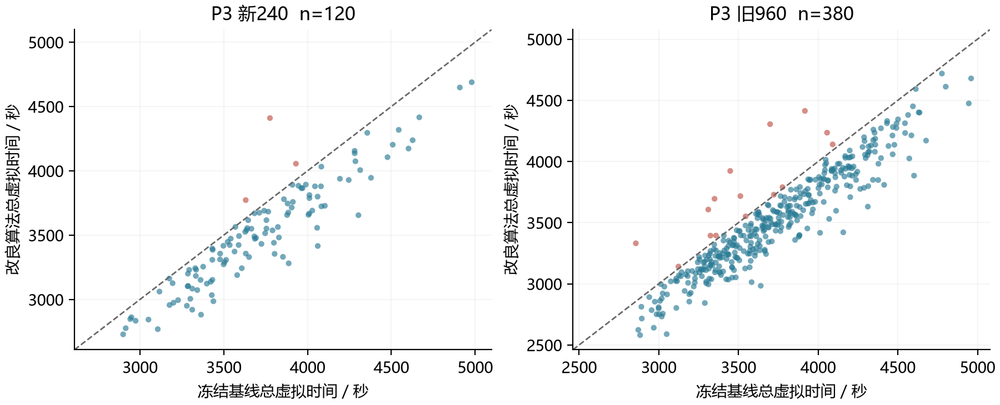
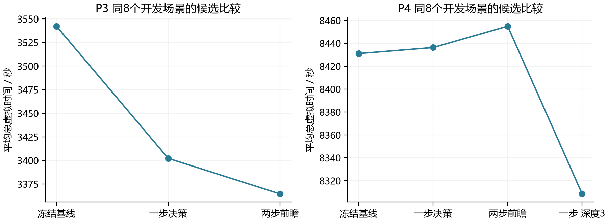
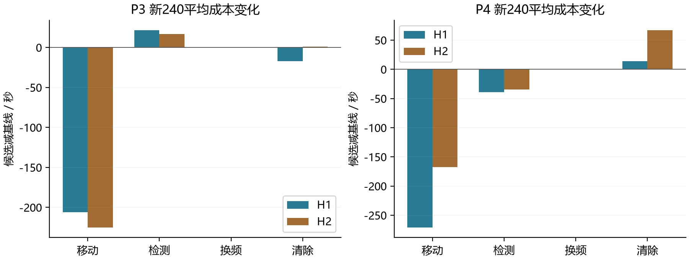
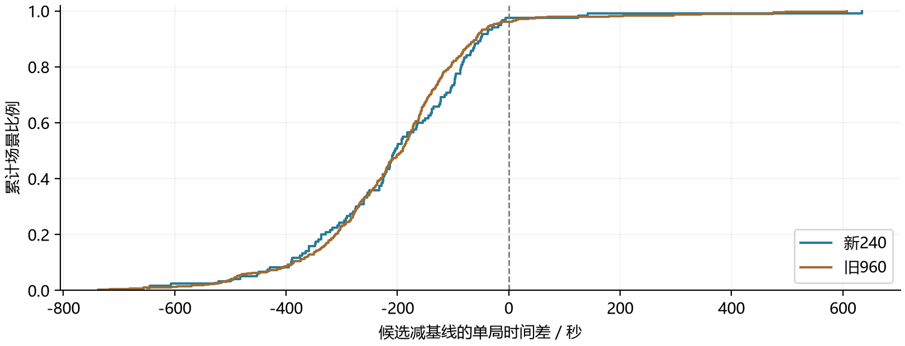
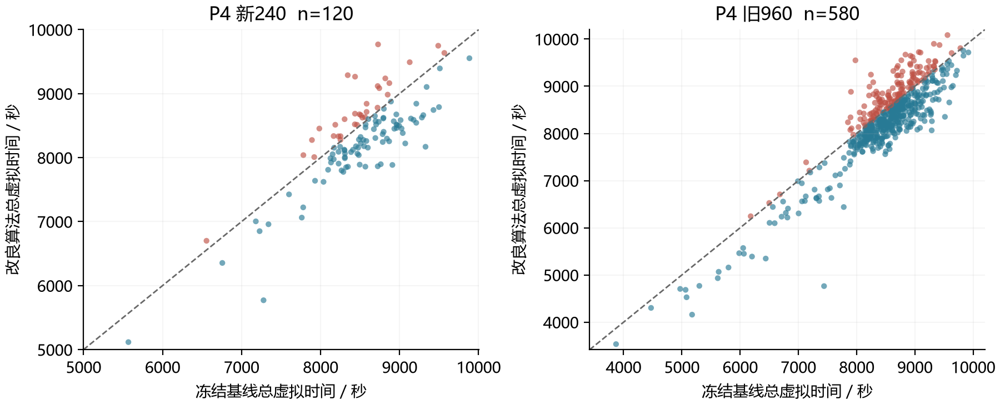
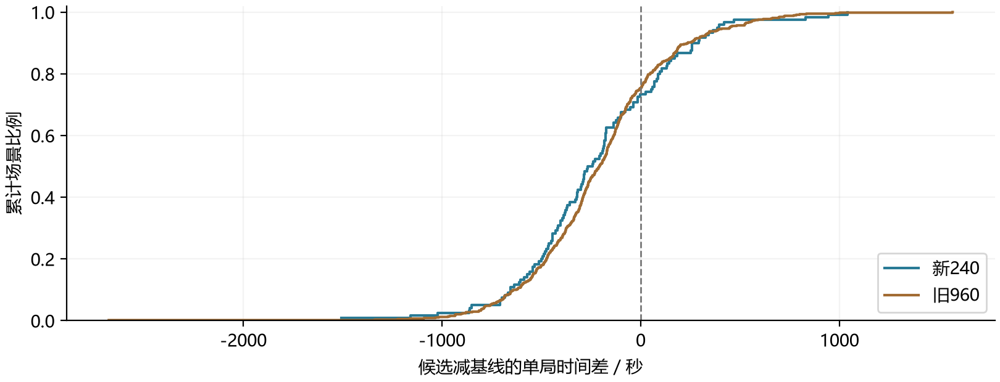

# 第三问与第四问全反馈搜索清除模型及实验报告

2026年9月12日

本报告研究一只机器狗在未知干扰源环境中，利用检测与清除反馈完成全域搜索、定位、清除及遗漏排除的问题。以全部清除为首要条件，以整局总虚拟时间为效率目标，建立全反馈集合约束下的部分可观测搜索清除优化模型。求解时结合连续几何覆盖、集合估计、工作概率和有限视界动态规划：第三问采用局部两步滚动前瞻，第四问采用混合可见性约束下的三反馈一步期望成本决策。

最终采用代码中的 P3 `dp_geometric` 与 P4 `three_feedback_fast`。在1200个不同本地场景中全部清除，另完成P3、P4各5局官方演练并全部清除。相对冻结侧线基线，新240场景中P3平均总时间由3720.46秒降至3515.94秒，P4由8513.88秒降至8298.37秒；旧960场景中的平均改善分别为5.55%和2.39%。这些是有限候选算法的经验结果。数据已参与筛选，工作概率未完整校准，不能据此声称连续策略空间的全局最优或未经选择的独立泛化性能。

## 研究对象与实验口径

题面规定源位于半径1800米的圆域内，20个频道互不干扰，每个源使用不同频道；源数为10至16，具体数量未知。源的有效接收半径为1000至1500米。第三问全部为全向源；第四问包含全向源和半圆定向源，类型与朝向未知。机器人从原点、频道1出发，可以在目标域外移动或检测。[1][2]

表1列出共同符号。下文区分真实物理状态、反馈所允许的状态集合，以及用于排序的工作概率。源的半径与朝向是固定未知量，不随一次新的观测重新抽取。

|符号|含义及单位|
|---|---|
|$\Omega$|目标圆域，$\Omega=\{g:\|g\|\le1800\}$|
|$f,N$|频道编号及真实源数，$f\in\{1,\ldots,20\}$，$10\le N\le16$|
|$g_f,R_f$|源位置及有效接收半径，米|
|$z_f,u_f$|第四问源类型及单位朝向向量，$z_f=0$为全向，$z_f=1$为定向|
|$x_t,c_t$|机器人当前位置及当前测向机频道|
|$\mathcal H_t,K_{f,t}$|历史反馈记录及与其相容的源状态集合|
|$\mathcal C_{f,t}$|保守位置单元的并集，包含尚未排除的位置|
|$D,M,S,A,C$|累计移动米数、检测数、换频数、清除尝试数、成功清除数|
|$T,\tau$|虚拟任务时间与程序现实运行时间，秒|
|$\widehat b_t,\widehat V_h$|工作状态分布及剩余视界为$h$的局部成本近似|

一次检测指令的成本包括直线移动、必要换频与5秒检测；清除指令的成本包括移动和3秒光学定位，成功时再加2秒。清除指令不改变测向机频道，也不产生测向换频费。因此有：

$$
c_m(x,c;q,f)=\frac{\|q-x\|}{5}+5+\mathbf 1\{c\ne f\}.
$$

$$
c_c(x;q,f,\theta)=\frac{\|q-x\|}{5}+3+2\mathbf 1\{f\text{ is present and }\|q-g_f\|\le20\}.
$$

$$
T=\frac D5+5M+S+3A+2C=\frac D5+5M+S+3F+5C,
$$

其中$F=A-C$。同世界完整清除时$C=N$固定，优化空间主要来自移动、检测、换频及失败尝试。多走500米需要100秒，不能仅因定位区域更小就判断该测点更优。

### 数据设计与对照关系

新240场景用于本轮迭代，旧960用于扩大回归范围。两批无重复世界；相同世界中候选与基线使用同一源配置和同一固定误差场。H1采用150米尺度平滑空间相关误差，作为主要参考；H2采用分区固定的极端误差，作为敏感性对照。H1和H2都不是逐次独立噪声。数量和类型组成参考官方统计，位置、半径、朝向及误差联合分布仍含仿真假设。[3][4]

|数据|P3 H1|P3 H2|P4 H1|P4 H2|合计|
|---|---:|---:|---:|---:|---:|
|新240迭代集|60|60|60|60|240|
|旧960回归集|190|190|290|290|960|
|本版官方演练|不标注H|不标注H|不标注H|不标注H|P3与P4各5局|

主要配对基线为冻结的 `p3_r1150_w1` 与 `p4_L2_d1200_w1`。新数据来源目录的 `compact1150`、`merged25_l1` 是另一组比较对象，其成绩单独归档，不混入本报告的主要提速百分比。

对场景$i$定义$\Delta_i=T_i^{\rm new}-T_i^{\rm base}$，负值为改善；提速采用均值之比$1-\overline T^{\rm new}/\overline T^{\rm base}$。平均每源时间采用逐局$T_i/N_i$的算术平均。两种跨场景汇总的权重不同，不能互换。未完成运行在早期实验中保留并赋予360000秒比较损失，该损失是实验选择工具，不是官方实际成绩。

## 1 第三问模型与求解

### 1.1 模型准备

本问要在全向源未知数量、位置及接收半径的条件下，完成发现、清除和遗漏排除。我们将其命名为“基于全反馈集合估计与局部两步前瞻的搜索清除优化模型”，代码策略名为 `dp_geometric`。

其物理机制有三点。第一，方向反馈限定方位扇区，但有界误差使交会区域具有面积，不能把两条报告方向线的交点当作真值。第二，无信号与正反馈共享同一接收半径，联立后提供额外位置约束。第三，光学清除半径20米允许通过有限覆盖完成清除，不要求先求出精确坐标。

采用以下假设和计算近似，并分别说明依据。

|序号|假设或近似|依据与作用|
|---|---|---|
|P3 A1|源位置、频道和接收半径在整局中固定，清除后移除|题设静态源及固定功率条件；使全部历史反馈可以联立|
|P3 A2|同地点误差固定，误差绝对值不超过1度|题设；不把原地重复检测当作独立降噪|
|P3 A3|二维直线移动，速度5米每秒，检测需停车|题设计费与平面条件；不另设障碍绕行或加速度模型|
|P3 A4|保守单元包含全部未排除位置，数值边界向外放宽|集合计算近似；实施中方位余量为1.0051度，清除半径取19.999米|
|P3 A5|工作位置、半径及反馈权重可近似评价行动价值|有限计算近似；不声称这些权重已等于官方真实后验|
|P3 A6|固定全局覆盖与目标调度，主要在当前目标内前瞻|分解求解选择；避免无限制跨频道树的计算与估价负担|

建模思路为：先用有几何保证的7站发现源，以正负反馈共同更新可能区域，再在“直接覆盖清除”和“追加检测后继续处理”之间比较预计时间；执行第一步后用真实反馈重新规划。集合约束承担不漏源的基础，工作概率承担动作的效率排序。

### 1.2 模型建立

令未清除频道的存在指示为$e_f$。第三问的接收条件为$e_f=1$且$\|q-g_f\|\le R_f$。有信号时，若距离不超过5米则返回near；否则返回带固定误差的方位角。记$d(q,g)=\|q-g\|$，方向差采用环绕到180度以内的最短角差，则：

$$
y_f(q)=\begin{cases}
\text{no signal},&e_f=0\text{ or }d(q,g_f)>R_f,\\
\text{near},&e_f=1,\ d(q,g_f)\le\min(5,R_f),\\
\text{direction }\alpha,&5<d(q,g_f)\le R_f.
\end{cases}
$$

$$
|\operatorname{wrap}(\alpha-\operatorname{atan2}(g_y-q_y,g_x-q_x))|\le1^\circ.
$$

相容集合递推为$K_{f,t+1}=K_{f,t}\cap\{\theta_f:O(\theta_f,a_t)=y_t\}$。清除失败增加$d(q,g_f)>20$，成功则将该频道标记为已清除。成功清除点只说明源在20米内，不等于真实源坐标。

设正反馈位置为$p$，无信号位置为$n$。由同一个$R_f$必须同时满足两条反馈，有：

$$
\|g-p\|\le R_f<\|g-n\|\ \Longrightarrow\ 2(n-p)^\top g<\|n\|^2-\|p\|^2.
$$

因此每个正负反馈对产生一个半平面约束。更完整的半径可行性要求存在$R_f\in[1000,1500]$，使全部正反馈距离不大于$R_f$，全部负反馈距离严格大于$R_f$。实现以外放边界保留严格不等式的边界邻域，不将浮点临界值强行排除。

位置表示为多边形单元并集$\mathcal C_{f,t}=\bigcup_j P_{f,t,j}$。在最长轴上二分，P3真实更新默认最大深度5，至多产生32个叶单元。若能证明整个单元位于已失败清除圆内，或无法解释全部接收反馈，则排除该单元；未证明不可能的单元继续保留。用于快速计算的凸包可能跨越空洞，最终清除点是否仍可能命中由单元并集判定。[5]

理论优化变量是只依赖公开历史的策略$\pi$。统一理想目标与限制可写为：

$$
\min_{\pi\in\Pi_{\rm adm}}\ \mathbb E_{\theta\sim P_*}[T_\pi(\theta)].
$$

$$
\Pi_{\rm adm}:\quad a_t=\pi(x_t,c_t,\mathcal H_t),\quad g_f\in\Omega,\quad1000\le R_f\le1500,\quad C_{\rm end}=N.
$$

同时要求动作与反馈相容、坐标有限且各分量绝对值不超过2000000米、虚拟时间小于360000秒，并在实际程序时限内退出；正常情况下enter后的程序时限最长1200秒，另受测试窗口约束。退出须具有全部频道已清除或已排除的依据，或已有16个不同频道清除成功。$P_*$并未由官方数据唯一恢复，实际选择使用配对样本成绩，在线采用工作分布$\widehat b_t$。这个模型属于部分可观测随机最短路的成本结构，当前实现求解其分层、有限视界近似，而非完整全局贝尔曼方程。

局部状态记为$S=(x,c,K_f,\mathcal C_f,b)$，$b$为剩余补测额度。令$\widehat V_0(S)$为立即执行当前几何覆盖的预计首击费用，则递推为：

$$
\widehat V_h(S)=\min\left\{\widehat V_0(S),\ \min_{q\in Q(S)}\left[c_m(x,c;q,f)+\sum_y\widehat p(y\mid S,q)\widehat V_{h-1}(U(S,q,y))\right]\right\}.
$$

near分支直接取后续清除费用5秒。P3取$h\le2$且$h\le b$；当前局部补测总上限由基线1次加1次，最多为2次。该增加是上限，若直接清除更便宜或已能一次清除，实际不会用满。

设几何覆盖顺序为$q_1,\ldots,q_L$，工作状态$s$的首次命中序号为$j(s)$，则终端价值近似为：

$$
\widehat V_0(S)=\sum_s w_s\left[\sum_{i=1}^{j(s)}\frac{\|q_i-q_{i-1}\|}{5}+3j(s)+2\right],\qquad q_0=x.
$$

覆盖点顺序仍按几何方式生成，未开启概率贪心排序。工作样本不被某覆盖点命中时，评分器使用完整遍历费用加3600秒惩罚；这只是估价惩罚，不代表执行器可以丢弃未采样区域。若没有工作样本，则退回几何基线。

选择此模型，是因为动作同时改变位置、目标完成状态及信息；仅优化定位误差不能表达这种反馈决策。混合算法中，几何覆盖处理完整性，集合估计处理有界误差，工作概率估计分支费用，有限视界动态规划比较行动。

### 1.3 模型求解

全局搜索采用原点加1150米正六边形。对半径$A=1800$的圆域，其到最近扫描点的最坏距离满足：

$$
\rho(r)^2=\max\{r^2/3,\ A^2+r^2-\sqrt3Ar\},\qquad r=1150.
$$

由此得到覆盖半径约为988.51米，小于最小接收半径1000米，因此对所有合法全向源位置具有发现覆盖。每站扫描尚未发现的频道。已发现目标按额外绕行费用安排服务，清除后从实际位置重排未访问站点。当前P3继承800米绕行阈值，覆盖点集合不随概率减少。

局部候选测点来自原主动测点、当前点、包络中心、沿首次方向构造的开放测点以及中心周围少量点。去除重复观测位置后，每层最多保留5个候选；每次规划共享最多8个测点展开额度，不是穷举所有两层分支。名义位置样本数40，压缩工作状态上限20，报告角分箱宽度8度。P3实际反馈以深度5更新，假设反馈分支使用深度0的较粗区域以控制计算量。

工作方向分支用误差代表值负0.9度、0度、正0.9度及权重1/6、2/3、1/6近似，并按报告角分箱；预测区域将角度约束额外加宽半个分箱。这是局部求积近似，没有完整估计固定误差场的空间条件分布，不能解释为题设规定的误差概率。[5]

```text
算法1  P3全反馈局部两步滚动前瞻
输入  公开题号、机器人客户端、固定算法配置
初始化  20个频道账本、7个扫描站、当前位置与频道
循环直到存在完整退出依据
    在下一覆盖站检测所有未知频道，逐条记录并更新单元并集
    若发现16个不同源，转为只处理已发现源
    按绕行费用选择一个已发现目标f
    若当前区域可被一个20米圆覆盖，执行最近安全清除
    否则设置剩余补测额度b为2
    当b大于0且目标未清除
        构造兼容工作状态与有限测点
        用h=min(2,b)比较直接覆盖与检测后各反馈分支费用
        若选择直接覆盖，结束补测循环
        执行所选的第一条检测；b减1；用真实反馈重建区域
        若near或可证一次清除，则执行清除
    对仍未清除目标执行完整几何覆盖，成功即停止
    从真实结束位置重排未访问扫描站
调用exit，输出结果和逐步记录
```

P3求解结果见表2。新240中的120局与旧960中的380局合计500局，均完整清除；两批中的H1、H2各占一半。

|数据|全清|基线平均T 秒|候选平均T 秒|平均提速|候选平均T/N 秒|
|---|---:|---:|---:|---:|---:|
|新240中的P3|120/120|3720.46|3515.94|5.50%|275.85|
|旧960中的P3|380/380|3732.81|3525.67|5.55%|273.81|



算法不是连续参数下降法，所以没有可报告的梯度收敛曲线。图2给出实际同8个开发场景的候选迭代记录：P3冻结基线均时3542.23秒，一步决策3402.16秒，两步前瞻3364.51秒。该图是候选比较，不是全局最优收敛证明。P3的两步臂同时多允许一次补测，现有消融不能把其全部增量仅归因于视界长度。



有限终止与数值稳定性需要分开讨论。对单次局部规划，候选与节点预算有限，递归深度不超过2；对目标处理，补测次数有限，之后执行有限覆盖；对全局搜索，只有7站和20频道。在真实源始终包含于保守区域、覆盖构造成立且计算与接口时限未耗尽的条件下，该控制流程具有有限结束路径。此结论不等于给出了最小总时间。

设几何更新费用为$G$，一次覆盖生成费用为$C_g$，工作状态数为$K$，覆盖点数为$L$，反馈组数为$Y$，实际展开额度为$A_{\max}$。忽略初始假设构造，单次有界规划费用可粗略写为$O(C_g+KL+A_{\max}Y(G+C_g+KL))$。现有默认$K\le20$、$A_{\max}=8$，几何费用随反馈数量和单元复杂度变化，不应把固定预算理解为常数毫秒响应。

### 1.4 结果分析

P3新240平均减少移动费用215.60秒，增加检测费用19.33秒，换频减少0.13秒，清除费用减少8.13秒，净节约204.52秒。说明额外检测只有在减少更长的后续移动时才产生价值。单独加强几何更新的完整新240消融仅节约约2.48秒，即0.07%，表明大部分收益来自根据新信息改变行动。[4]



误差机制敏感性如表3。区间为原报告通过2000次同场景配对bootstrap得到的约95%百分位区间；其描述条件是当前数据与已选择算法，不抵消反复选型带来的偏差。

|数据与机制|样本|平均节约 秒|提速|变慢局数|平均差区间 秒|
|---|---:|---:|---:|---:|---|
|新240 H1|60|201.42|5.38%|2|[-238.41, -164.48]|
|新240 H2|60|207.61|5.61%|1|[-252.21, -160.94]|
|旧960 H1|190|216.00|5.81%|5|[-235.95, -195.37]|
|旧960 H2|190|198.27|5.29%|10|[-221.91, -173.06]|

两种误差机制和两批场景中均有平均改善，支持收益在现有工作模型内较稳定。新240仍有3局变慢，最大634.69秒；旧960有15局变慢，最大606.81秒。新240最差退步中，移动增加581.69秒、检测增加40秒、换频增加4秒、清除增加9秒，主要问题是后续行走路径，而非检测本身。



本机并行实验中的P3平均程序耗时，新240为23.13秒、旧960为22.96秒，高于约1至3秒的基线。这是计算代价，与约3500秒的虚拟任务时间不同。单次规划60秒为紧急保护参数，不是精确实时调度证明。全套最终数据中有34场因旧5秒保护触发而补跑；旧记录与补跑来源均保留。

### 1.5 结果检验

第一，模型一致性检验：逐场检查真实源是否仍包含于记录的凸包和位置单元并集中；最终P3共500局无记录到的区域误排。第二，任务完成检验：全部实际清除成功，退出依据使用频道排除或16源上限，不向策略提供真实N。第三，计费检验：按原始移动、检测、换频和清除次数重算T，结果文件保留计费残差。第四，反馈一致性检验：本地候选和基线共享同一固定误差场，不把同站多测当作新噪声。

本版另进行了5局官方演练，结果见表4。演练与本地仿真属于不同证据；这些是新增官方案例，没有旧算法同案例对照，不能据此计算官方相对提速。[6]

|官方案例编码|源数|清除数|总虚拟时间 秒|平均每源时间 秒|程序时间 秒|
|---|---:|---:|---:|---:|---:|
|AJTU-7P9Y-SY88-VXX7|15|15|3316.25|221.08|13.937|
|TS6T-JTBH-YMHS-33HG|13|13|3778.30|290.64|15.402|
|MEE4-QDUE-VM4N-5VBU|12|12|3146.34|262.20|11.907|
|DWHX-GXYF-2TFM-WUAK|14|14|3908.43|279.17|13.945|
|YY26-DCHS-JZ68-H67Y|14|14|3130.95|223.64|15.570|
|均值|13.6|13.6|3456.05|255.35|14.152|

以上是演练记录，本报告未将其写作题目要求的三次正式测试成绩。几何外包与有限覆盖解释了算法的完整性设计，有限样本全清则检验了本批实施结果；二者都不构成平均时间全局最优的证明。

## 2 第四问模型与求解

### 2.1 模型准备

第四问在相同任务目标和计费规则下增加了源类型、辐射朝向的不确定性。我们将其命名为“基于混合可见性集合估计与三反馈期望成本的搜索清除优化模型”，代码策略名为 `three_feedback_fast`。它采用几何约束与工作概率相结合的混合求解：全向、定向解释在约束层并存，局部决策按三类反馈的期望后续费用比较。

本问的关键机理是无信号的析取含义。全向源收不到信号可由距离解释；定向源还可能因机器人位于辐射半平面之外而不可见。无信号有信息价值，但不能简单裁掉检测点附近的一个圆。另一方面，光学清除只依赖距离，与源朝向无关，因此有限清除覆盖仍可复用。

|序号|假设或近似|依据与作用|
|---|---|---|
|P4 A1|继承P3的静态源、频道独立、二维移动及固定误差假设|第四问明确其他条件与第三问相同|
|P4 A2|每个源固定为全向或定向；定向源在朝向两侧各90度内可见，含边界|题设；同一源全历史使用同一个类型、半径和朝向|
|P4 A3|位置与朝向采取保守有限划分，排除时使用整个分区的外放界|计算近似；避免用少数朝向采样代替不存在证明|
|P4 A4|未知类型的工作先验默认全向和定向各0.5，半径分为5段|现有评分器默认值；不是已校准的官方类型比例|
|P4 A5|局部一步预测后重新规划，全局25站与目标调度继承基线|成本和模型误差折中；一步指每次预测深度，不是整局只测一次|

建模流程为：用25站保证在未知方向下的发现能力，联合正负反馈维护全向与定向的可能解释，比较检测后的方位、near、无信号三类分支与直接覆盖清除。实测选择一步版本，是当前候选与数据中的效果结论，不意味着任意更深规划都无效。

### 2.2 模型建立

引入类型$z_f\in\{0,1\}$和单位向量$u_f$。存在且未清除源的可见条件为：

$$
V_f(q)=\mathbf1\{\|q-g_f\|\le R_f\}\,\mathbf1\{z_f=0\text{ or }u_f^\top(q-g_f)\ge0\}.
$$

在可见条件下，再以距离5米划分near和方位反馈；不可见则为no signal。对已知存在源，无信号约束为：

$$
\|q-g_f\|>R_f\quad\text{or}\quad[z_f=1\text{ and }u_f^\top(q-g_f)<0].
$$

完整相容集合$K_{f,t}$要求存在同一组$(g_f,R_f,z_f,u_f)$解释所有反馈。全向集合与定向集合的并集都保留；只有两种解释均不可能时，位置才被排除。清除失败的20米排除仍同时适用于两种源，因为光学作用范围不受朝向影响。

当前真实位置更新最大深度为3，二分后最多8个叶单元。对单元$P$，正反馈给出接收半径下界：

$$
R_{\rm low}(P)=\max\{1000,\ \max_{p\in\mathcal P_t}d(P,p)\},
$$

其中$d(P,p)$为点到多边形的最小距离。若某无信号位置$n$满足$\max_{g\in P}\|n-g\|<R_{\rm low}(P)$，则单元内的所有相容源都已在接收距离内，这条负反馈必须由背向解释。于是同一朝向须同时面向全部正反馈、背向这些强制负反馈。

实现将朝向圆分为16扇区，对每个扇区使用中心方向$u_0$与半宽$\delta$。由于$\|u-u_0\|\le2\sin(\delta/2)$，有：

$$
|(u-u_0)^\top v|\le2\sin(\delta/2)\,\|v\|.
$$

据此对正负朝向条件向外放宽，形成必要半平面约束。如果所有扇区都被排除，才否定定向解释。保留下来的扇区不一定真实可行，体现的是保守外近似。程序并未精确恢复所有连续朝向和半径。

第四问的理想优化目标仍为$\min_{\pi\in\Pi_{\rm adm}}\mathbb E[T_\pi]$，在P3约束基础上增加类型与半平面可见性，并要求$\|u_f\|=1$、光学清除与$u_f$无关、所有正负反馈使用同一个$(R_f,z_f,u_f)$。搜索和退出约束保持完整，不允许以低工作概率代替不存在证明。

当前局部策略只展开一次检测后的反馈，记三类结果集合为$\mathcal Y(q)$，方位类内部再按8度分箱：

$$
Q(q\mid S)=c_m(x,c;q,f)+\sum_{y\in\mathcal Y(q)}\widehat p_y\widehat V_0(U(S,q,y)).
$$

$$
a^*(S)=\operatorname*{argmin}\left\{\widehat V_0(S),\ \{Q(q\mid S):q\in Q(S)\}\right\}.
$$

其中$\widehat V_0$使用更新后的实际覆盖生成器估计首击费用；near后续费用为5秒。与旧版用半径或旧110点条带近似相比，当前比较对象更直接对应执行的清除路线。真实反馈后可以再次调用同一个一步决策器，只要局部剩余额度未用完；每个目标仍最多追加2次检测。

工作状态包括位置、固定半径、固定朝向或全向标志。对位置按单元面积提出确定性样本；半径采用5段的代表值，朝向区间须与全部历史记录相容，再压缩到最多20个状态。分支概率由这些状态的权重归并得到。它是有限离散的相容假设分布，未接入完整官方联合先验，也不携带未来误差场的精确条件分布。

选择这个混合模型的理由是，集合方法能够保留有界误差下的排除依据，但不能单独衡量某条信息的平均价值；工作概率能够对分支费用加权，却不足以证明低概率区域没有源。两部分在同一决策中各自承担其适合的任务。

### 2.3 模型求解

全局发现层继承25站定向覆盖。其三角网格标称间距为995米；构造保留与1800米圆域外放区域相交的闭三角单元所需顶点。在任意可能源附近，三角单元及外放余量提供多个方向的检测点，并使有关距离小于最小接收半径。由局部凸组合与朝向半平面关系，可保证任意合法朝向具有可见检测点。[7]

当前25站从原点完整访问的静态路线长24095.423821米，对这组固定站点的距离下界为24095.423819米。该结果只说明同点集完整路线已接近其下界，不证明25站是所有布局中站数最少，也不说明动态清除插入后的整局时间已经最优。

局部真实反馈使用深度3单元，假设分支使用深度0外近似。每次规划最多5个候选、共享8个测点展开额度、20个压缩工作状态；当前未开启概率贪心覆盖排序、单点概率试探和低概率截断。目标间服务仍采用已有绕行调度，阈值1200米，完成当前源后再选择下一个源。

```text
算法2  P4混合可见性约束下的三反馈成本决策
初始化  25个覆盖站及每频道的全向与定向可能解释
循环直到存在完整退出依据
    扫描本站未知频道，记录方向、near或无信号
    用同一个半径及朝向解释全历史，更新保守单元并集
    按绕行成本选择已发现目标f
    若可证一次清除，则执行清除；否则剩余检测额度b为2
    当b大于0且目标未清除
        生成相容工作状态与候选测点
        计算直接覆盖的预计首击费用V0
        对每个测点计算移动、换频、检测及三反馈后续费用
        若直接覆盖更便宜，结束补测循环
        执行选定测量；b减1；按真实反馈更新并重新决策
        若near或可证一次清除，执行清除
    对未清除目标执行完整覆盖，每次失败后更新排除区域
    重排未访问站点，检查16源上限或逐频道排除依据
调用exit并保存记录
```

表5给出P4最终完整结果。新240中的120局与旧960中的580局合计700局，全部清除。

|数据|全清|基线平均T 秒|候选平均T 秒|平均提速|候选平均T/N 秒|
|---|---:|---:|---:|---:|---:|
|新240中的P4|120/120|8513.88|8298.37|2.53%|666.12|
|旧960中的P4|580/580|8476.30|8274.04|2.39%|657.61|



候选筛选中，同8个P4开发场景的基线均时8430.97秒，默认一步方案8436.20秒，两步方案8454.86秒；采用深度3位置单元的快速一步版本为8308.49秒。这支持当前一步配置，但样本仅8局，不能视作所有深度设置的充分比较。最终判断依据是表5的完整两批配对结果。

P4的递归深度为1，单次规划的有界费用形式与P3相同；朝向检查增加了约16个扇区上的半平面运算。降低真实细分深度减少单元数，但可能保留更多不可能位置，故计算量和虚拟行动费用之间存在折中。新240与旧960平均程序耗时分别为45.17秒、43.14秒。程序时间的增加已实际计入报告，没有与虚拟任务节约相抵或混为同一个指标。

### 2.4 结果分析

新240 H1中，P4移动节约271.24秒、检测节约39.42秒、换频节约0.47秒，清除费用增加13.80秒，净节约297.33秒。H2净节约133.70秒，清除增加67.15秒。两组都允许多一些清除尝试，但通过少走路、少补测获得整体收益。仅增加全反馈几何的完整消融平均节约7.74秒，即0.09%，说明反馈必须改变动作才能兑现其时间价值。

|数据与机制|样本|平均节约 秒|提速|变慢局数|平均差区间 秒|
|---|---:|---:|---:|---:|---|
|新240 H1|60|297.33|3.51%|12|[-395.60, -194.91]|
|新240 H2|60|133.70|1.56%|20|[-228.91, -36.51]|
|旧960 H1|290|237.22|2.80%|58|[-278.73, -195.82]|
|旧960 H2|290|167.29|1.97%|85|[-212.34, -124.11]|

H2下收益较小，说明P4更受分支近似及误差机制影响。新240有32/120局变慢，旧960有143/580局变慢；最大退步分别为1042.22秒和1570.36秒。旧960最差退步由移动增加1087.36秒、检测30秒、换频12秒和清除441秒构成。总体平均改善并不意味着复杂定向场景逐局占优。



消融中，早期概率贪心排序曾使P3平均时间增加约20.9%，概率排序与前瞻组合曾使P4增加约9.0%；低概率截断在早期每题8局中仅3局全清。这些是对应旧开发记录的现象，部分早期代码还存在随后修复的几何数值问题，不能当作最终代码下的统一完整排名。最终两臂均未开启这些机制。名义小概率预算不能替代实际漏检控制。

### 2.5 结果检验

本地P4最终700局全部实际清除，未记录区域误排。对同一频道，每条方向、无信号和清除失败反馈共同作用于同一个固定半径与朝向的假设；对朝向分区采用外放约束，避免将某个代表朝向不满足条件误写成整段朝向都不可能。

退出检验有三类公开依据：16个不同频道清除成功；未发现频道完成全部必要覆盖且已发现源全清；或某频道的保守相容单元并集被证明为空。工作状态样本为空本身不触发不存在判定。达到16个已发现源时，只停止寻找新源，仍要取得剩余源的实际清除成功反馈。

本版5局官方演练结果见表7。N和Nd来自演练结束后的官方显示，仅用于结果统计，不作为运行中的策略输入。

|官方案例编码|N/Nd|清除|总虚拟时间 秒|平均每源时间 秒|程序时间 秒|
|---|---:|---:|---:|---:|---:|
|67HD-3HYX-EGS8-QVQD|16/2|16/16|3637.90|227.37|33.389|
|S6J2-EDRR-HAYP-XBDD|13/1|13/13|8707.94|669.84|35.362|
|QVR6-23Y9-B22A-KFKH|11/3|11/11|7799.04|709.00|23.867|
|UMSB-MJDC-J7YS-V4Z8|13/1|13/13|7806.62|600.51|27.421|
|Y9SY-2Y39-8568-56NR|15/11|15/15|8494.76|566.32|34.605|
|均值|13.6/3.6|全部清除|7289.25|554.61|30.929|

两题官方10局共2129条请求全部被接受，规划计算保护未触发。P4第一局达到16源上限，搜索发现阶段能够提前结束；它对5局均值的影响较大。另有两局末次成功清除后仍需约1571秒、1629秒进行搜索和遗漏确认。这个尾程是事后诊断，不是运行时已经知道可以省去的时间；算法不能用事后N提前退出。

官方样本仅用于说明接口运行与实测完成情况，既无同案例旧算法对照，也不是题目要求的三次正式测试。P4最慢和最快案例的源数组成不同，因此不能由个别清除失败次数推断策略优劣。

## 3 共同结果检验与结论

最终保留的1200场景由P3的500场和P4的700场组成，不将基线运行、补跑、早期候选重复计为独立世界。最终结果指向明确的实际采用记录；触及旧5秒计算保护的34场单独补跑，其余未触及保护的完整搜索直接复用。原始结果和最终采用结果均在归档中保留。

本报告配图和百分位数由已经存在的最终逐局记录生成，没有新增仿真实验。P95采用对最终时间序列的线性插值95分位；统计值及制图脚本随报告交付。所有图中变慢案例均保留，红色散点或时间差大于0的部分表示实际退步。

|数据与题目|基线P95 秒|候选P95 秒|候选平均程序秒|候选最大程序秒|
|---|---:|---:|---:|---:|
|新240 P3|4509.85|4240.64|23.13|36.14|
|旧960 P3|4469.40|4261.03|22.96|38.56|
|新240 P4|9346.54|9293.72|45.17|63.02|
|旧960 P4|9360.59|9414.07|43.14|70.25|

P3的两批P95均下降；P4旧960的P95增加约53.48秒，进一步说明平均收益没有覆盖全部尾部指标。最终1200局记录的最大绝对计费残差约0.0000463秒，处于微秒计费取整与浮点累计的量级。

从第一性原理看，改良的核心是在保持完整搜索与清除依据的条件下，用当前反馈估计行动能节省多少后续时间。P3的全向可见性较易推断，局部两步前瞻与额外补测额度形成稳定的平均收益；P4需同时解释半径、类型、朝向，其工作模型更粗，一步三反馈决策在当前数据上取得较好的成本与计算折中。

现有结论支持采用P3局部两步前瞻和P4三反馈成本决策，但支持范围是当前配置、数据和固定误差工作机制。全清率、平均时间、退步尾部和程序耗时须同时呈现。报告未把均值降低解释为每局更快，也未把保守几何构造解释为平均费用的全局最优证明。

## 4 脚本数据与复现入口

交付目录中，`01_latest_algorithm`保存本版完整脚本、输入、结果、原始日志及官方记录；`02_historical_exploration`保存主线、各侧线、历史数据包、研究说明和既有交付物。历史文件维持原内容，最新报告与历史对照分别标注日期和基线。

|路径|用途|
|---|---|
|`01_latest_algorithm/selected_policy.py`|按公开题号选择最终算法|
|`01_latest_algorithm/feedback/region.py`|全部反馈的保守几何单元更新|
|`01_latest_algorithm/feedback/belief.py`|相容工作状态与反馈分支权重|
|`01_latest_algorithm/feedback/planner.py`|直接覆盖与有限视界成本比较|
|`01_latest_algorithm/feedback/solver.py`|真实反馈执行与重规划|
|`01_latest_algorithm/evaluate_selected.py`|新旧算法同世界评测入口|
|`01_latest_algorithm/inputs`|新240、旧960及冻结基线等输入|
|`01_latest_algorithm/reports/final_new240`|新240最终逐局表与差异|
|`01_latest_algorithm/reports/final_core960`|旧960最终逐局表与差异|
|`01_latest_algorithm/runs`|全部请求、决策、补跑与官方原始记录|

本地评测使用Python 3.10及以上，在最新算法目录运行：

```text
python -X utf8 evaluate_selected.py --dataset inputs/new240/cases.json --output runs/my_replay --workers 6
```

该入口默认同时运行冻结基线，输出目录应为新目录；只评估候选可加`--no-baseline`。函数接口为`selected_policy.make_solver(client, problem)`。正式数学模型的输入是反馈历史，场景真值仅由本地模拟器与事后评测器读取。

## 参考材料

[1] B题题面及附录1至4，无线电干扰源的快速自动定位与清除。归档：`02_historical_exploration/B题/B题.pdf`。

[2] 模拟器使用说明与通信接口说明。归档：`02_historical_exploration/B题/附件/附件1.docx`及`附件2.docx`。

[3] 最新工程README、selection.json及inputs内的数据接收记录。归档：`01_latest_algorithm`。

[4] 全反馈实验最终报告、final_new240与final_core960逐局及配对汇总。归档：`01_latest_algorithm/reports`。

[5] 全反馈几何、工作分布、局部规划与执行源码。归档：`01_latest_algorithm/feedback`。

[6] 最新P3与P4各5局官方演练原始记录及表格。归档：`01_latest_algorithm/runs/official_practice_5_each_20260912_1430`。

[7] 原7站与25站覆盖构造、synthesis及selected历史实验。归档：`02_historical_exploration/B_solution_side_research`。

[8] 主线历轮本地迭代、官方对照、P4覆盖改进与实验报告。归档：`02_historical_exploration/B_solution/results`及`docs`。
